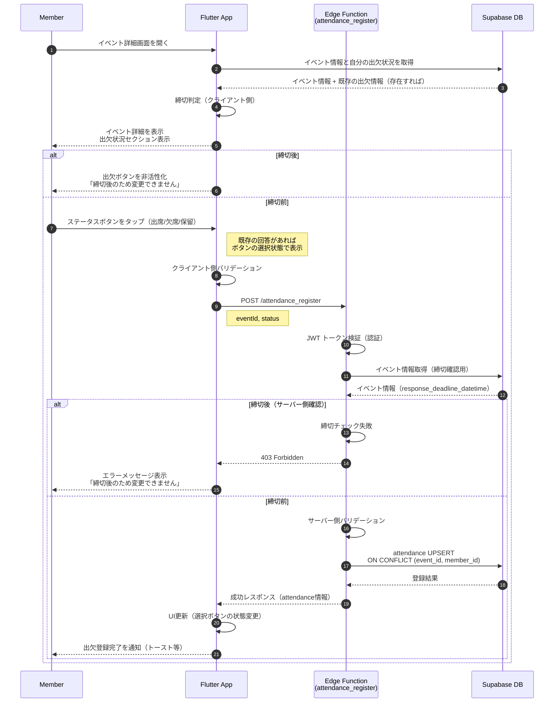

# 出欠登録 (Attendance Register)

## ユーザーフロー / シーケンス



### ステップ説明

1. **イベント詳細表示（1-5）**: イベント情報と自分の既存の出欠情報を取得し、出欠状況セクションを表示
   - 既存の回答がある場合は、該当するボタンが選択状態で表示される
   - 締切日時を確認し、締切後であればボタンを非活性化

2. **締切後の場合（6）**: 出欠ボタンを非活性化し、「締切後のため変更できません」と表示

3. **締切前の場合（7-19）**:
   - **ボタンタップ（7）**: 3つのボタン（出席/欠席/保留）のいずれかをタップ
   - **クライアント側バリデーション（8）**: 必須項目のチェック
   - **認証（10-12）**: JWT トークン検証とイベント情報取得
   - **サーバー側締切チェック（13-15）**: 二重チェックとして締切を再確認（クライアント時計のずれ対策）
   - **データ登録（16-18）**: `(event_id, member_id)` のユニーク制約により UPSERT 実行
   - **UI更新（19）**: 選択ボタンの状態を更新し、トースト通知で完了を知らせる

4. **コメント入力**: コメントは別途設計（出欠ボタンとは独立した入力欄）

## データモデル / API

### 参照テーブル

- [`attendance`](tables.md#attendance) - 出欠レコード
- [`events`](../events/tables.md#events) - イベント情報（締切日時の取得）
- [`user`](../auth/tables.md#user) - メンバー情報

### Edge Function: `attendance_register`

**エンドポイント**: `POST /attendance_register`

#### リクエスト

| フィールド | 型 | 必須 | 説明 |
| --- | --- | --- | --- |
| `eventId` | `uuid` | ○ | イベント ID |
| `status` | `string` | ○ | 出欠ステータス (`attending` / `not_attending` / `pending`) |
| `comment` | `string` |  | 任意コメント（理由や補足情報） |

```json
{
  "eventId": "550e8400-e29b-41d4-a716-446655440000",
  "status": "attending",
  "comment": "よろしくお願いします！"
}
```

#### レスポンス（成功: 200 OK）

```json
{
  "id": "660e8400-e29b-41d4-a716-446655440000",
  "eventId": "550e8400-e29b-41d4-a716-446655440000",
  "memberId": "770e8400-e29b-41d4-a716-446655440000",
  "status": "attending",
  "comment": "よろしくお願いします!",
  "createdAt": "2025-12-21T10:00:00Z",
  "updatedAt": "2025-12-21T10:00:00Z"
}
```

#### レスポンス（エラー）

| エラーコード | HTTP | 説明 |
| --- | --- | --- |
| `unauthorized` | 401 | 認証されていない（JWT トークンが無効） |
| `validation_error` | 400 | 入力値バリデーション失敗（不正なステータス値など） |
| `forbidden_after_deadline` | 403 | 締切後に変更を試みた（全員が変更不可） |
| `event_not_found` | 404 | 指定されたイベントが存在しない |

```json
{
  "code": "forbidden_after_deadline",
  "message": "締切後のため、出欠の変更はできません。"
}
```

### バリデーションルール

| ルール | チェック内容 | 実施場所 |
| --- | --- | --- |
| 必須項目 | eventId, status | Client + Server |
| ステータス値 | `attending`, `not_attending`, `pending` のいずれか | Client + Server |
| イベント存在確認 | eventId が events に存在すること | Server |
| 締切確認 | response_deadline_datetime の判定 | Client + Server（二重チェック） |

### UPSERT ロジック

出欠登録時、`attendance` テーブルを以下のロジックで更新：

- **ユニーク制約**: `(event_id, member_id)`
- **動作**: `ON CONFLICT (event_id, member_id) DO UPDATE` により、既存レコードがあれば更新、なければ挿入
- **メタデータ更新**: `updated_at` と `updated_user` は自動更新

## 権限・セキュリティ

### RLS ポリシー

attendance テーブルは RLS を設定せず、Edge Function 側で権限制御を実施。

### Edge Function 認証・権限

1. **認証**: Supabase Auth の JWT トークンを検証
2. **締切前**: すべての認証済みメンバーが自分の出欠を登録・更新可能
3. **締切後**: 全員（manager含む）が変更不可
   - `403 Forbidden` を返す

### 締切判定ロジック

```typescript
const now = new Date()
const deadline = new Date(event.responseDeadlineDatetime)
const isAfterDeadline = deadline && now > deadline

if (isAfterDeadline) {
  return c.json(
    {
      code: 'forbidden_after_deadline',
      message: '締切後のため、出欠の変更はできません。'
    },
    403
  )
}
```

**クライアント側でも同様の判定を実施**し、締切後はボタンを非活性化することでUX向上。

## エラー・フォールバック

| エラー状況 | ユーザーへの導線 |
| --- | --- |
| バリデーションエラー | 該当フィールドにエラーメッセージを表示、修正を促す |
| 締切後の変更試行 | 「締切後のため変更できません」と表示（クライアント側では事前にボタン非活性化） |
| ネットワークエラー | リトライボタンを表示 |
| 認証エラー | 「ログインが必要です」と表示し、ログイン画面へ遷移 |
| イベントが存在しない | 「イベントが見つかりません」と表示し、イベント一覧へ遷移 |

## 未決定事項 / Follow-up

- コメント入力のUX（ボタンタップ時にテキストフィールドを表示するか、常時表示するか）
- 出欠登録時の Slack / LINE 通知機能（Edge Function `attendance_webhook` で実装予定）
- 出欠状況の集計・表示機能（別途 `attendance_list.md` で設計）
- リマインド機能（別途 `attendance_remind.md` で設計）
