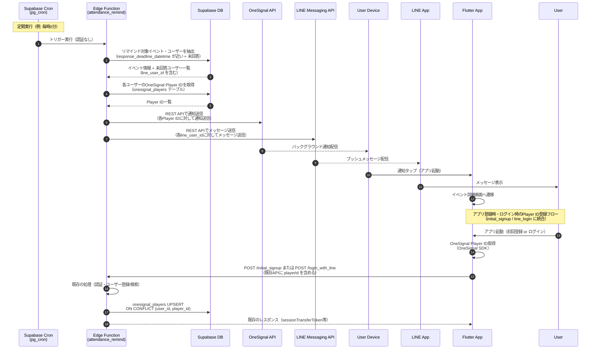

# 出欠リマインド (Attendance Remind)

## ユーザーフロー / シーケンス



### ステップ説明

1. **定期実行トリガー（1-2）**: Supabase の `pg_cron` 拡張機能を使用し、定期的に Edge Function を呼び出す（例: 毎時0分に実行）
   - Edge Function は認証なしで実行可能とする（Service Role キーで保護）

2. **リマインド対象の抽出（3-4）**:
   - `events.response_deadline_datetime` が指定時間内（例: 24時間以内）のイベントを抽出
   - 各イベントに対して、`attendance` テーブルで `status = 'pending'` または未登録のユーザーを特定
   - イベント情報（タイトル、締切日時など）と未回答ユーザー一覧（`line_user_id` を含む）を取得

3. **通知先情報取得（5-6）**: 各未回答ユーザーに対して通知先情報を取得
   - OneSignal Player ID: `onesignal_players` テーブルから取得（1ユーザーが複数端末を持っている場合は、すべての端末に通知を送信）
   - LINE User ID: `user.line_user_id` から取得（既に保持されているため、追加の登録処理は不要）

4. **通知送信（7-8）**: Edge Function から複数の通知チャネルに並列で送信
   - **OneSignal通知送信**: OneSignal REST API を使用して各Player IDに対してバックグラウンド通知を送信
     - 通知にはイベントタイトル、締切日時、イベントIDを含める
     - アプリがバックグラウンドまたは終了していても通知を受信可能
   - **LINEメッセージ送信**: LINE Messaging API を使用して各LINE User IDに対してプッシュメッセージを送信
     - メッセージにはイベントタイトル、締切日時を含める
     - ユーザーがLINE公式アカウントを友だち追加している必要がある

5. **通知受信と画面遷移（9-11）**: ユーザーが通知を受信
   - OneSignal通知: 通知をタップするとアプリが起動しイベント詳細画面へ遷移
   - LINEメッセージ: LINEアプリ内でメッセージが表示される（アプリへの遷移は未実装、将来の拡張として検討）

6. **OneSignal Player ID登録フロー（12-16）**: アプリ登録時・ログイン時にOneSignal Player IDを登録
   - アプリ起動時に OneSignal SDK でPlayer IDを取得
   - 既存の `initial_signup` または `login_with_line` Edge Functionに `playerId`を含めて呼び出し
   - Edge Function内で `onesignal_players` テーブルにUPSERT（既存の Player ID があれば更新、なければ新規登録）
   - **注意**: LINE User IDは既に `user.line_user_id` に保持されているため、追加の登録処理は不要

## データモデル / API

### 参照テーブル

- [`attendance`](tables.md#attendance) - 出欠レコード（未回答ユーザーの特定）
- [`events`](../events/tables.md#events) - イベント情報（締切日時の取得）
- [`user`](../auth/tables.md#user) - ユーザー情報
- [`onesignal_players`](../auth/tables.md#onesignal_players) - OneSignal Player ID管理（新規テーブル）

### 新規テーブル: `onesignal_players`

詳細は [`auth/tables.md`](../auth/tables.md#onesignal_players) を参照。

**設計意図**: OneSignalを使用する場合、端末token（device_token）の管理はOneSignal側で自動的に行われますが、ユーザーIDとOneSignal Player IDの紐付けが必要です。そのため、`onesignal_players` テーブルでユーザーIDとPlayer IDを管理します。

### Edge Function: `attendance_remind`（リマインド送信）

**エンドポイント**: `POST /attendance_remind`（定期実行用、認証なし）

#### `attendance_remind` リクエスト

定期実行のため、リクエストボディは空または設定値のみ。

```json
{}
```

または、リマインド時間の設定（オプション）:

```json
{
  "remindHoursBefore": 24
}
```

#### 処理フロー

1. **リマインド対象イベントの抽出**:

   ```sql
   SELECT e.*
   FROM events e
   WHERE e.response_deadline_datetime IS NOT NULL
     AND e.response_deadline_datetime > NOW()
     AND e.response_deadline_datetime <= NOW() + INTERVAL '24 hours'
   ```

2. **未回答ユーザーの特定**:

   ```sql
   SELECT u.id, u.line_user_id
   FROM user u
   WHERE u.status = 'active'
     AND NOT EXISTS (
       SELECT 1
       FROM attendance a
       WHERE a.event_id = :event_id
         AND a.member_id = u.id
         AND a.status != 'pending'
     )
   ```

3. **通知先情報取得**:
   - **OneSignal Player ID取得**:
     ```sql
     SELECT op.player_id
     FROM onesignal_players op
     WHERE op.user_id = :user_id
       AND op.is_active = true
     ```
   - **LINE User ID取得**: `user.line_user_id` は既に取得済み（ステップ2で取得）

4. **通知送信**: OneSignalとLINE Messaging APIに並列で送信
   - **OneSignal通知送信**: OneSignal REST API を使用して各Player IDに通知を送信
     ```typescript
     const response = await fetch('https://onesignal.com/api/v1/notifications', {
       method: 'POST',
       headers: {
         'Content-Type': 'application/json',
         'Authorization': `Basic ${ONESIGNAL_REST_API_KEY}`
       },
       body: JSON.stringify({
         app_id: ONESIGNAL_APP_ID,
         include_player_ids: [playerId],
         headings: { en: eventTitle },
         contents: { en: `回答期限: ${deadlineDateTime}` },
         data: {
           eventId: eventId,
           type: 'attendance_remind'
         }
       })
     })
     ```
   - **LINEメッセージ送信**: LINE Messaging API を使用して各LINE User IDにメッセージを送信
     ```typescript
     const response = await fetch('https://api.line.me/v2/bot/message/push', {
       method: 'POST',
       headers: {
         'Content-Type': 'application/json',
         'Authorization': `Bearer ${LINE_CHANNEL_ACCESS_TOKEN}`
       },
       body: JSON.stringify({
         to: lineUserId,
         messages: [
           {
             type: 'text',
             text: `${eventTitle}の出欠回答期限が迫っています\n回答期限: ${deadlineDateTime}`
           }
         ]
       })
     })
     ```

#### `attendance_remind` レスポンス（成功: 200 OK）

```json
{
  "processedEvents": 3,
  "sentNotifications": {
    "onesignal": 15,
    "line": 12
  },
  "errors": []
}
```

- `sentNotifications.onesignal`: OneSignal通知の送信成功数
- `sentNotifications.line`: LINEメッセージの送信成功数
- 各通知チャネルは独立して送信されるため、一方が失敗しても他方は送信される

#### `attendance_remind` レスポンス（エラー）

| エラーコード | HTTP | 説明 |
| --- | --- | --- |
| `notification_error` | 500 | 通知送信エラー |
| `database_error` | 500 | データベースエラー |

### OneSignal Player ID登録処理

OneSignal Player IDの登録は、既存の `initial_signup` と `login_with_line` Edge Functionに統合する。

#### `initial_signup` への追加

- **リクエストに追加**: `playerId` フィールドを追加（任意）
- **処理に追加**: ユーザー登録成功後、`onesignal_players` テーブルにUPSERT
- 詳細は [`initial_signup.md`](../auth/initial_signup.md) を参照

#### `login_with_line` への追加

- **リクエストに追加**: `playerId` フィールドを追加（任意）
- **処理に追加**: ログイン成功後、`onesignal_players` テーブルにUPSERT
- 詳細は [`line_login.md`](../auth/line_login.md) を参照

#### UPSERT ロジック

OneSignal Player ID登録時、`onesignal_players` テーブルを以下のロジックで更新：

- **ユニーク制約**: `(user_id, player_id)`
- **動作**: `ON CONFLICT (user_id, player_id) DO UPDATE` により、既存レコードがあれば更新（`updated_at` を更新）、なければ挿入
- **メタデータ更新**: `updated_at` と `updated_user` は自動更新
- **Player IDが未提供の場合**: エラーにはせず、スキップ（通知機能はオプション）

## 権限・セキュリティ

### RLS ポリシー

`onesignal_players` テーブルは RLS を設定せず、Edge Function 側で権限制御を実施。

### Edge Function 認証・権限

#### `attendance_remind`

1. **認証**: 認証なし（定期実行用）
2. **保護**: Supabase Secrets に保存された Service Role キーを使用し、内部からのみ実行可能とする
3. **実行方法**: Supabase の `pg_cron` 拡張機能を使用して定期実行
4. **外部API認証情報**: OneSignal REST API Key と LINE Messaging API チャンネルアクセストークンを Supabase Secrets に保存し、環境変数から取得

#### OneSignal Player ID登録（`initial_signup` / `login_with_line` 内で処理）

1. **認証**: 既存の `initial_signup` / `login_with_line` の認証フローに統合
2. **権限**: 認証済みユーザーは自分のOneSignal Player IDのみ登録・更新可能
3. **検証**: `auth.uid()` または登録時の `user_id` を使用して `onesignal_players` テーブルにUPSERT

**注意**: LINE User IDは既に `user.line_user_id` に保持されているため、追加の登録処理は不要。LINE Messaging API を使用するには、ユーザーがLINE公式アカウントを友だち追加している必要がある。

### 通知サービス実装

#### OneSignal REST API

Edge Function から OneSignal REST API を使用してバックグラウンド通知を送信する。

**API仕様**:

```typescript
const response = await fetch('https://onesignal.com/api/v1/notifications', {
  method: 'POST',
  headers: {
    'Content-Type': 'application/json',
    'Authorization': `Basic ${ONESIGNAL_REST_API_KEY}`
  },
  body: JSON.stringify({
    app_id: ONESIGNAL_APP_ID,
    include_player_ids: [playerId1, playerId2, ...],
    headings: { en: title },
    contents: { en: body },
    data: {
      eventId: eventId,
      type: 'attendance_remind'
    }
  })
})
```

- **認証**: OneSignal REST API Key を Supabase Secrets に保存し、Basic認証で使用
- **Player ID管理**: `onesignal_players` テーブルから有効なPlayer IDを取得
- **通知内容**: タイトル、本文、カスタムデータ（イベントIDなど）を含める
- **複数端末対応**: 1ユーザーが複数端末を持っている場合、すべてのPlayer IDを `include_player_ids` に指定

**参考**: [OneSignal REST API ドキュメント](https://documentation.onesignal.com/reference/create-notification)

#### LINE Messaging API

Edge Function から LINE Messaging API を使用してプッシュメッセージを送信する。

**API仕様**:

```typescript
const response = await fetch('https://api.line.me/v2/bot/message/push', {
  method: 'POST',
  headers: {
    'Content-Type': 'application/json',
    'Authorization': `Bearer ${LINE_CHANNEL_ACCESS_TOKEN}`
  },
  body: JSON.stringify({
    to: lineUserId,
    messages: [
      {
        type: 'text',
        text: `${eventTitle}の出欠回答期限が迫っています\n回答期限: ${deadlineDateTime}`
      }
    ]
  })
})
```

- **認証**: LINE Messaging API チャンネルアクセストークンを Supabase Secrets に保存し、Bearer認証で使用
- **LINE User ID管理**: `user.line_user_id` から取得（既に保持されているため、追加の登録処理は不要）
- **メッセージ内容**: イベントタイトル、締切日時を含むテキストメッセージ
- **友だち追加要件**: ユーザーがLINE公式アカウントを友だち追加している必要がある。未追加の場合は送信エラーとなるが、処理は継続する
- **送信制限**: LINE Messaging API には送信レート制限があるため、大量送信時は適切な間隔を設ける

**参考**: [LINE Messaging API ドキュメント](https://developers.line.biz/ja/docs/messaging-api/overview/)

**設計意図**: OneSignalとLINE Messaging APIの両方を使用することで、通知の到達率を向上させる。一方のチャネルが失敗しても、他方のチャネルで通知が届く可能性がある。また、ユーザーがアプリをインストールしていない場合でも、LINEメッセージで通知を受け取ることができる。

### 定期実行の設定

Supabase の `pg_cron` 拡張機能を使用して定期実行を設定：

```sql
-- 毎時0分に実行
SELECT cron.schedule(
  'attendance-remind-hourly',
  '0 * * * *',
  $$
  SELECT net.http_post(
    url := 'https://your-project.supabase.co/functions/v1/attendance_remind',
    headers := jsonb_build_object(
      'Content-Type', 'application/json',
      'Authorization', 'Bearer ' || current_setting('app.settings.service_role_key')
    ),
    body := '{}'::jsonb
  );
  $$
);
```

## エラー・フォールバック

| エラー状況 | ユーザーへの導線 | システム側の対応 |
| --- | --- | --- |
| OneSignal送信エラー | 通知は届かないが、ユーザーは通常通りアプリを使用可能 | エラーログを記録し、リトライは次回の定期実行に任せる。LINEメッセージは送信を継続 |
| LINE送信エラー（友だち未追加） | LINEメッセージは届かないが、OneSignal通知は届く可能性がある | エラーログを記録し、送信をスキップ。OneSignal通知は送信を継続 |
| LINE送信エラー（その他） | LINEメッセージは届かないが、OneSignal通知は届く可能性がある | エラーログを記録し、リトライは次回の定期実行に任せる。OneSignal通知は送信を継続 |
| Player ID無効 | 通知は届かない | `onesignal_players.is_active = false` に更新し、次回のアプリ起動時に再登録を促す。LINEメッセージは送信を継続 |
| データベースエラー | 通知は届かない | エラーログを記録し、次回の定期実行でリトライ |
| ネットワークエラー（登録/ログイン時） | リトライボタンを表示 | アプリ側でリトライロジックを実装（Player ID登録失敗は通知機能に影響するが、登録/ログイン自体は成功） |
| 認証エラー（登録/ログイン時） | 「ログインが必要です」と表示し、ログイン画面へ遷移 | - |

### 通知未到達時の対応

- **OneSignal通知**:
  - OneSignal API から無効な Player ID が返された場合、`onesignal_players.is_active = false` に更新
  - アプリ起動時に `is_active = false` の Player ID があれば、新しい Player ID を取得して再登録
  - 通知送信に失敗した場合、エラーログを記録し、次回の定期実行でリトライ

- **LINEメッセージ**:
  - LINE Messaging API からエラーレスポンスが返された場合、エラーログを記録し、送信をスキップ
  - 友だち未追加エラー（HTTP 400）の場合は、ユーザーにLINE公式アカウントの友だち追加を促す案内を検討（将来の拡張）
  - 送信レート制限エラー（HTTP 429）の場合は、適切な間隔を設けてリトライ（将来の拡張）

- **並列送信の利点**: OneSignalとLINE Messaging APIは独立して送信されるため、一方が失敗しても他方は送信される。これにより、通知の到達率が向上する。

## 未決定事項 / Follow-up

1. **リマインドのタイミング**: 締切の何時間前に通知を送信するか（例: 24時間前、12時間前、1時間前）。複数回送信する場合は、送信間隔も決定する必要がある。
2. **通知文言**: 通知のタイトル・本文の内容を決定する（例: 「出欠回答のお願い」「[イベント名]の出欠回答期限が迫っています」など）。OneSignalとLINEで同じ文言を使用するか、それぞれ最適化するか。
3. **定期実行の頻度**: どの程度の頻度で定期実行するか（例: 毎時、毎30分、毎日など）。頻度が高いほどリアルタイムに近いが、Supabase のリソース使用量が増える。
4. **複数回リマインド**: 締切前に複数回リマインドを送信する場合、送信済みフラグの管理方法を決定する（例: `attendance_remind_log` テーブルを作成して送信履歴を管理）。
5. **通知のカスタマイズ**: ユーザーが通知のON/OFFを設定できる機能の要否を検討する（例: `user_settings` テーブルに `onesignal_notification_enabled` / `line_notification_enabled` カラムを追加）。
6. **LINE公式アカウントの友だち追加促進**: ユーザーがLINE公式アカウントを友だち追加していない場合の案内方法を検討する（例: アプリ内で案内表示、初回登録時の案内など）。
7. **LINEメッセージのリッチ化**: テキストメッセージ以外に、クイックリプライやFlex Messageを使用して出欠回答を直接LINEから行えるようにするか検討する（将来の拡張）。
8. **送信レート制限の対応**: LINE Messaging API の送信レート制限に達した場合のリトライ戦略を検討する（例: 指数バックオフ、送信キューイングなど）。
9. **LINEメッセージからのアプリ遷移**: LINEメッセージをタップした際にアプリを起動する機能（LINE URL Scheme / Universal Links）の実装を検討する（将来の拡張）。
10. **OneSignal SDK統合**: FlutterアプリにOneSignal SDKを統合し、Player IDを取得する方法を確認する（既に実装済み）。
11. **OneSignal設定**: OneSignalアカウントの作成、アプリの登録、iOS/Androidの証明書・キー設定が必要（既に設定済み）。
12. **LINE Messaging API設定**: LINE Developers Console でのMessaging APIチャンネル作成、チャンネルアクセストークンの取得が必要。