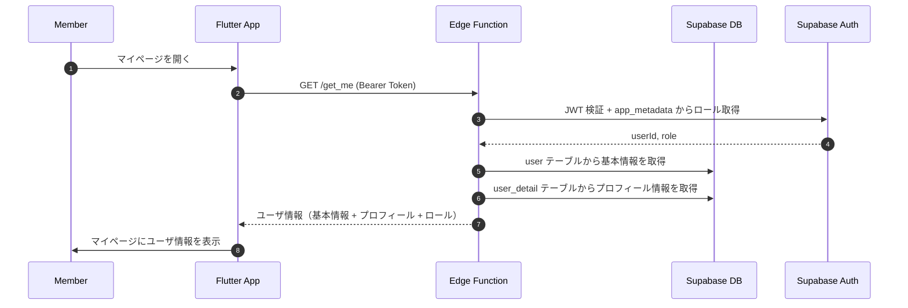

# ユーザ情報取得 (Get Me)

## ユーザーフロー / シーケンス


1. **Member→App**: マイページやプロフィール画面を開く。
2. **App→Edge**: Supabase セッションの Bearer Token 付きで `GET /get_me` を呼び出し。
3. **Edge→Supabase**: `authMiddleware` で JWT を検証し、`userId` と `app_metadata.role` を取得。
4. **Edge→DB**: `user` テーブルから `line_user_id`、`status`、`last_login_datetime` を取得。
5. **Edge→DB**: `user_detail` テーブルから `display_name`、`avatar_url` を取得。
6. **Edge→App**: 統合した情報を JSON で返却。
7. **App→Member**: 取得したユーザ情報を画面に表示。

## データモデル / API
- 参照テーブル: `user`、`user_detail`（[`auth/tables.md`](tables.md)）。
- Edge Function: `GET /get_me`
  - **Input**
    - Header: `Authorization: Bearer <access_token>`
  - **Process**
    1. `authMiddleware` で JWT を検証し、`userId` と `userRole` を Context に設定。
    2. `user` テーブルから `userId` で基本情報を取得。
    3. `user_detail` テーブルから `userId` でプロフィール情報を取得。
    4. ロール情報は `authMiddleware` で取得済みの `userRole` を使用。
    5. 統合した情報をレスポンスとして返却。
  - **Output (成功)**
    ```json
    {
      "userId": "uuid",
      "lineUserId": "string",
      "status": "active",
      "lastLoginDatetime": "2025-01-01T00:00:00Z",
      "displayName": "表示名",
      "avatarUrl": "https://...",
      "role": "member"
    }
    ```
  - **エラーコード例**: `unauthorized`, `user_not_found`, `internal_error`。

## 権限・セキュリティ
- `authMiddleware` で JWT 検証を必須とし、未認証リクエストは 401 を返却。
- ログイン中のユーザー自身の情報のみ取得可能（他ユーザーの情報は取得不可）。
- ロール情報は Supabase Auth の `app_metadata.role` から取得（DB に別途ロールテーブルは持たない）。

## エラー・フォールバック
- `unauthorized`: 「ログインが必要です。」を表示し、ログイン画面へ遷移。
- `user_not_found`: ユーザーレコードが見つからない場合（通常は発生しない想定だが、データ不整合時の安全策）。
- `internal_error`: 予期しないエラー。再試行を促す。

## 未決定事項 / Follow-up
- なし（現時点の方針で実装着手可）。

