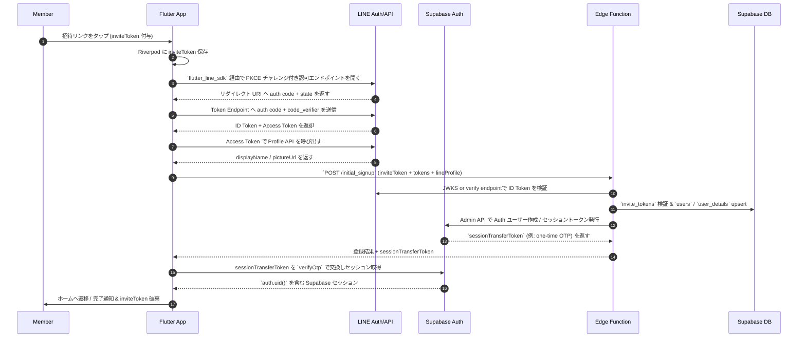

# 初回登録 (Initial Signup)

## ユーザーフロー / シーケンス


1. **Member→App**: 招待リンクをタップすると `inviteToken` が付与された状態でアプリが起動する。現状は枠数制限を設けず、`expires_datetime` のみで有効性を管理する。
2. **App→App**: `SignupState` が `inviteToken` を Riverpod に保存。セッション中は保持し、ログアウトや完了時にクリアする。
3. **App→LINE (SDK)**: Supabase セッションが無い場合、LINE Flutter SDK を用いて認可エンドポイントへ遷移し、PKCE チャレンジを付与してログインを開始。
4. **LINE→App**: 認証完了後、LINE がリダイレクト URI へ auth code + state を付与して戻す（SDK がハンドル）。
5. **App→LINE**: SDK から得た auth code と code_verifier をそのまま Token Endpoint に送り、ID/Access Token を取得。
6. **App→LINE (Profile)**: 取得した Access Token を SDK 経由で Profile API へ渡し、displayName / pictureUrl を取得。
7. **App→Edge**: `inviteToken` と LINE から得た ID Token / Profile 情報を `POST /initial_signup` に送信。Edge Function 側が以降の検証と登録を担当する。
8. **Edge→LINE**: JWKS 取得 or verify API を通じて ID Token を検証し、署名や `nonce` を確認。
9. **Edge→DB**: `invite_tokens` 検証、既存 `users` 確認、未登録なら `users` / `user_details` upsert を単一トランザクションで実施。
10. **Edge→Supabase**: Service Role（`supabase.auth.admin`）で Supabase Auth ユーザーを作成/更新し、`auth.admin.generateLink(type='magiclink')` などで一度きりの `sessionTransferToken` を発行。
11. **Edge→App**: トークンと登録結果を返す。既存ユーザーだった場合は `already_registered` を返し、`sessionTransferToken` は渡さない。
12. **App→Supabase**: 受け取った `sessionTransferToken` を `verifyOtp({ type: 'magiclink' })` などで交換し、最終的な Supabase セッション (`auth.uid()`) を取得。
13. **App→Member**: 成功したら `inviteToken` を破棄しホームへ遷移。失敗時はエラー表示と再試行導線を提供。

## データモデル / API
- 本機能が利用するテーブル仕様は `auth/tables.md` に集約（`users`, `user_details`, `invite_tokens`）。初回登録はこれら 3 テーブルを Edge Function 経由で更新する。
- `users` には `auth.uid()` と LINE ユーザ ID をマッピングし、`user_details` に LINE 由来のプロフィール情報を同期する。`invite_tokens` は有効期限のみを持ち、枠数制限は設けない。

### Edge Function / API: `POST /functions/v1/initial_signup`
- **Input**
  ```json
  {
    "inviteToken": "string",
    "lineTokens": {
      "idToken": "string",
      "accessToken": "string"
      // 今回は nonce 未使用（PKCE のみ利用）
    },
    "lineProfile": {
      "lineUserId": "string",
      "displayName": "string",
      "avatarUrl": "https://..."
    }
  }
  ```
- **Process**
  1. LINE JWKS で `lineTokens.idToken` を検証し、`aud` を突合（`nonce` は今回未利用）。
2. `invite_tokens` で `token_hash` 一致と `expires_datetime` > now を検証。
 3. `users` / `user_details` を INSERT（または upsert）。既存ユーザーがいれば `already_registered` を返す。
  4. Supabase Admin API で Auth ユーザーを作成/更新し、`sessionTransferToken`（例: magic link 用 OTP, 有効期限デフォルト 5 分想定）を発行。
- **Output**
  ```json
  {
    "userId": "uuid",
    "sessionTransferToken": "string" // 既存ユーザーだった場合は null
  }
  ```
- **エラーコード例**: `token_not_found`, `token_expired`, `already_registered`。

## 権限・セキュリティ
- Edge Function は Supabase Auth 認証済みユーザーのみ実行可。`auth.uid()` を `users.id` に使うため、他人のアカウントで初回登録することはできない。
- `invite_tokens` へのアクセスは `role = 'manager'` の運営のみ `select/insert` を許可。メンバーは Edge Function 経由でしか検証できない。
- Edge Function は Supabase の Service Role キー（管理用シークレット）を利用するため、Supabase Secrets にのみ保存し、HTTP リクエスト越しに露出させない。
- `sessionTransferToken` を返す際は HTTPS 前提で 1 回だけ使用可の OTP を採用する。
- Riverpod に保存した `inviteToken` はログアウト時・登録完了時に必ず破棄し、端末内に残さない。
- `users.line_user_id` にユニーク制約を設け、LINE 側でアカウント乗っ取りがあっても二重登録されないようにする。
- LINE ID Token の検証では JWKS のキャッシュ時間 (`kid` 切替) を考慮し、`aud`/`iss`/`exp`/`nonce` を必ず検証する。

## エラー・フォールバック
- **token_expired**: 有効期限を明示したエラーメッセージを出し、再発行依頼導線を用意。
- **already_registered**: 既存ユーザーが誤って招待リンクを踏んだケース。ホームに遷移し「すでに参加済みです」とトースト表示。
- **ネットワーク障害**: Edge Function 失敗時は `inviteToken` を破棄せずに再トライ可能な状態を保つ。Riverpod に保持し続け、ユーザーにはリトライボタンを提示。

## 未決定事項 / Follow-up
1. 招待リンク発行 UI をアプリ内に実装するか（現状は Supabase コンソール運用、概要は `overview.md` の後続案件に記載）。
2. LINE プロフィールの再同期タイミング（現状は初回登録時の一括取得のみ、後続案件として `overview.md` に記載）。
