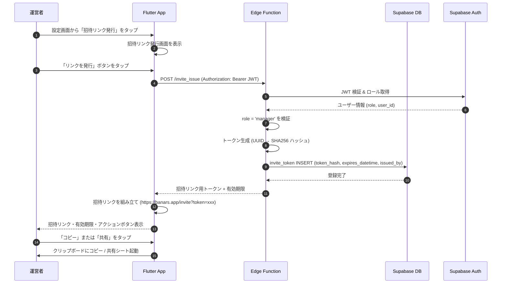

# 招待リンク発行 (Invite Issue)

## ユーザーフロー / シーケンス



1. **運営者→App**: 設定画面の「管理」セクションから「招待リンク発行」タイルをタップして招待リンク発行画面へ遷移。
2. **App**: 招待リンク発行画面を表示（説明テキストと発行ボタン）。
3. **運営者→App**: 「リンクを発行」ボタンをタップ。
4. **App→Edge**: `POST /functions/v1/invite_issue` に Supabase Auth の JWT を付与してリクエスト（`expirationDays` は省略でデフォルト 7 日）。
5. **Edge→Supabase**: Authorization ヘッダーの JWT を検証し、ユーザー情報（`role`, `user_id`）を取得。
6. **Edge (検証)**: `role = 'manager'` でない場合は 403 Forbidden を返す。
7. **Edge (トークン生成)**: `crypto.randomUUID()` で生トークンを生成し、SHA256 でハッシュ化。生トークンはレスポンス用に保持。
8. **Edge→DB**: `invite_token` テーブルに `token_hash`, `expires_datetime`（7 日後）, `issued_by`（発行者の user_id）を INSERT。
9. **Edge→App**: 生トークン（ハッシュ前の値）と有効期限を返却。
10. **App**: 受け取ったトークンから招待リンク（`https://banars.app/invite?token=<token>`）を組み立てる。
11. **App→運営者**: 招待リンク、有効期限、「コピー」ボタン、「共有」ボタンを表示。
12. **運営者→App**: 「コピー」ボタンをタップしてクリップボードにコピー、または「共有」ボタンで OS の共有シートを起動（LINE、メールなどへ共有）。

## データモデル / API

- 本機能が利用するテーブル仕様は [`auth/tables.md`](tables.md) に集約（`invite_token`）。
- 生トークンは DB に保存せず、SHA256 ハッシュのみを `token_hash` として保存する。これにより、DB 漏洩時にも招待リンクの不正利用を防ぐ。

### Edge Function / API: `POST /functions/v1/invite_issue`

- **Input**

  ```json
  {
    "expirationDays": 7
  }
  ```

  - `expirationDays`: 有効期間（日数）。省略時はデフォルト 7 日。1〜30 の範囲で指定可能。

- **Process**
  1. Authorization ヘッダーから JWT を取得し、Supabase Auth で検証。
  2. JWT の `role` クレームが `manager` であることを確認。
  3. `crypto.randomUUID()` で 36 文字の生トークンを生成。
  4. 生トークンを SHA256 でハッシュ化し、`token_hash` を得る。
  5. `invite_token` テーブルに INSERT:
     - `token_hash`: ハッシュ値
     - `expires_datetime`: `now() + expirationDays days`
     - `issued_by`: 発行者の `user_id`
     - `created_user`: 発行者の `user_id`

- **Output**

  ```json
  {
    "token": "550e8400-e29b-41d4-a716-446655440000",
    "expiresAt": "2025-12-13T12:00:00.000Z"
  }
  ```

  - `token`: 招待リンクに埋め込む生トークン（ハッシュ前の値）。
  - `expiresAt`: 有効期限（ISO 8601 形式）。

- **エラーコード**:
  - `unauthorized` (401): JWT が無効または未指定。
  - `forbidden` (403): `role` が `manager` でない。
  - `invalid_request` (400): `expirationDays` が範囲外。
  - `internal_error` (500): DB 操作の失敗など。

### 招待リンクの形式

アプリ側で以下の形式の招待リンクを組み立てる想定:

```text
https://<app-domain>/invite?token=<token>
```

または Deep Link 形式:

```text
banars://invite?token=<token>
```

## 権限・セキュリティ

- Edge Function は Supabase Auth 認証済みユーザーのみ実行可能。未認証リクエストは 401 を返す。
- JWT の `role` クレームが `manager` であることを必須とし、一般メンバーによる発行を防止。
- `invite_token` テーブルには RLS ポリシーが設定されており、`manager` ロールのみ `SELECT` / `INSERT` が許可されている（既存マイグレーション参照）。
- 生トークンはレスポンスで一度だけ返却し、DB には SHA256 ハッシュのみを保存。これにより:
  - DB 漏洩時にトークンの逆算が困難。
  - 初回登録時は受け取った生トークンをハッシュ化して `token_hash` と照合。
- Edge Function は Supabase の Service Role キーを利用するため、Supabase Secrets にのみ保存。

## 未決定事項 / Follow-up

1. ~~招待リンク発行 UI をアプリ内に実装する際の画面設計（現状は Supabase Console / curl 運用）~~ → 決定済み
2. 発行済みトークン一覧の閲覧・無効化機能の要否（当面は不要、将来的に検討）。
3. Deep Link のスキーム（`banars://` など）の正式決定。
4. 招待リンクのドメイン（`https://banars.app`）の確定。
