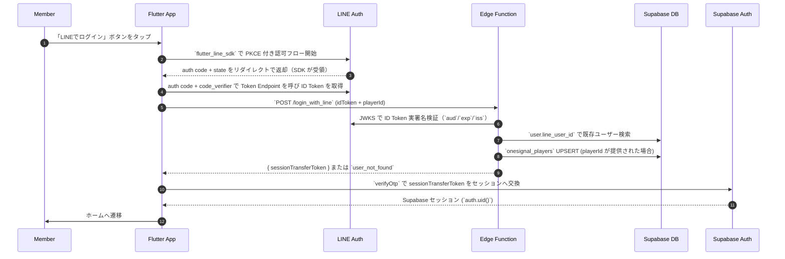

# LINE ログイン (Line Login)

## ユーザーフロー / シーケンス



1. **Member→App**: 「LINEでログイン」をタップ。
2. **App→LINE (SDK)**: `flutter_line_sdk` で PKCE 認可。初回のみ同意画面、以後は LINE 側に同意が残っていればワンタップで戻る（同意画面の有無は LINE 側ポリシー依存）。
3. **LINE→App**: auth code + state をリダイレクトで受領。
4. **App→LINE**: code + code_verifier でトークン交換し ID Token を取得（Access Token は保持するが以降は使わない）。
5. **App→Edge**: ID Token と OneSignal Player ID（取得できた場合）を `login_with_line` へ送信。
6. **Edge→LINE**: JWKS で署名検証し、`aud`/`exp`/`iss` を確認（nonce は未使用）。
7. **Edge→DB**: `user.line_user_id` に一致するレコードを検索。見つからなければ `user_not_found`。
8. **Edge→DB**: `playerId` が提供された場合、`onesignal_players` テーブルにUPSERT（`user_id` と `player_id` の紐付け）。
9. **Edge→App**: 既存ユーザーなら Admin API で発行した `sessionTransferToken` を返却。
10. **App→Supabase**: `verifyOtp({ type: 'magiclink', token: sessionTransferToken })` で Supabase セッションを取得。
11. **App→Member**: セッション確立後ホームへ遷移。

### Web の補足
- Web は LIFF で ID トークンを取得し、同じ `POST /login_with_line` を呼び出す。
- Edge Function の検証・セッション発行フローはモバイルと共通とする。

## データモデル / API
- 参照テーブル: `user`（`auth/tables.md`）。`user_detail` は更新しない。
- Edge Function: `POST /login_with_line`
  - **Input**
    ```json
    {
      "idToken": "string",
      "playerId": "string" // 任意: OneSignal Player ID
    }
    ```
  - **Process**
    1. LINE JWKS で ID Token を検証。
    2. `user.line_user_id` で既存ユーザーを検索。
    3. 見つからなければ `user_not_found`。
    4. `playerId` が提供された場合、`onesignal_players` テーブルにUPSERT（`user_id` と `player_id` の紐付け）。
    5. 見つかれば Admin API で Auth ユーザーの `sessionTransferToken` を発行し返却。
  - **Output (成功)**
    ```json
    {
      "sessionTransferToken": "string"
    }
    ```
  - **エラーコード例**: `token_invalid`, `token_expired`, `user_not_found`。

### トークン管理ポリシー
- LINE 連携は `flutter_line_sdk` を使用。ID Token のみ Edge Function へ送付し、Access Token はクライアント内で短期保持するが以降の処理では利用しない。
- Supabase セッションは `supabase_flutter` の自動リフレッシュに任せる。JWT 有効期限は 24 時間（`JWT expiration = 86400`）、Refresh Token は 7 日を想定。再取得できない場合のみ再ログインを促す。
- プロフィール再同期は行わない（初回登録時の情報をそのまま使用）。

## 権限・セキュリティ
- Edge Function は匿名呼び出し可とするが、Service Role キーは Supabase Secrets にのみ保存しレスポンスへ露出させない。
- ID Token 検証の必須チェック: 署名、`aud`/`iss`/`exp`。`nonce` は未使用であることを明記。
- `user.line_user_id` にユニーク制約を設定し、多重登録を防止。

## エラー・フォールバック
- `user_not_found`: 「チームに未登録です。招待リンクから初回登録を行ってください。」等の案内（UI 文言は後日確定）。
- `token_invalid` / `token_expired`: 再ログインを促す。
- 通信エラー: セッションを作らず再試行導線を提示。

## 未決定事項 / Follow-up
- なし（現時点の方針で実装着手可）。
