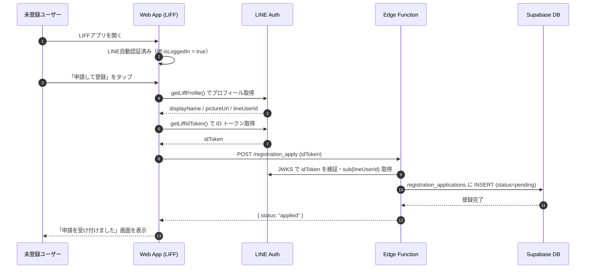
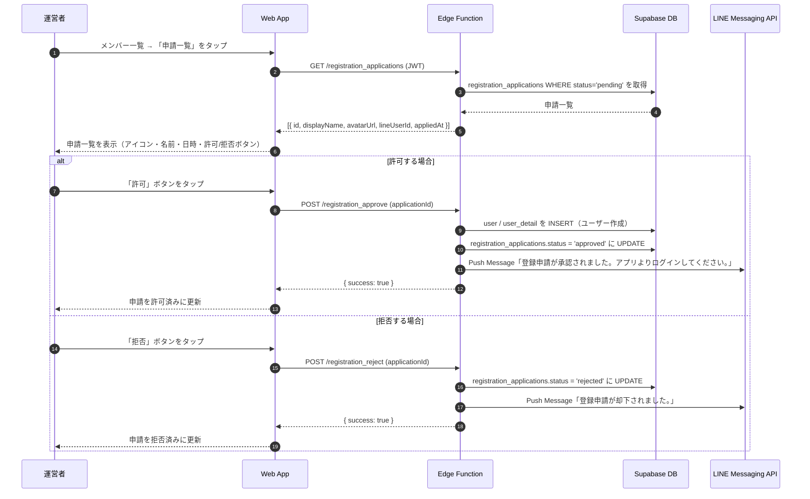

# 登録申請・許可 (Registration Application)

## ユーザーフロー / シーケンス

### 申請フロー（申請者側）



1. **User→App**: LIFFアプリを開いた時点で LINE 認証は完了している。
2. **App**: 「申請して登録」ボタンをタップ。LIFF SDK でプロフィールと ID トークンを取得。
3. **App→Edge**: `POST /registration_apply` に ID トークンのみ送信（プロフィールはサーバー側でトークンから取得）。
4. **Edge**: LINE JWKS で ID トークンを検証し、`sub`（LINE User ID）・`name`・`picture` を取得。
5. **Edge→DB**: `registration_applications` テーブルに INSERT（`status = 'pending'`）。同一 LINE User ID で pending レコードが既に存在する場合は `already_pending` を返す。拒否済み（`rejected`）の場合は新規 INSERT（再申請を許可）。
6. **App**: 申請完了画面を表示。次回起動時に再度申請しようとした場合は「申請済みです」表示。

### 申請一覧・承認フロー（運営側）



1. **Manager→App**: メンバー一覧画面の右上に pending 件数バッジ付きアイコンを配置。タップで申請一覧ページへ遷移。
2. **App→Edge**: `GET /registration_applications`（manager JWT 必須）で pending の申請一覧を取得。
3. **許可**: `POST /registration_approve` → ユーザー作成（`user` / `user_detail` INSERT、Supabase Auth ユーザー作成は不要）→ status 更新 → LINE Push 通知。
4. **拒否**: `POST /registration_reject` → status 更新 → LINE Push 通知。
5. **承認後の申請者ログイン**: 申請者が次回 LIFF を開くと `line_login` で `user` が見つかり自動ログインされる。

> **承認時のユーザー作成について**: `registration_approve` では `user` / `user_detail` テーブルへの INSERT のみ行う。Supabase Auth ユーザーの作成は `line_login` 時（初回ログイン時）に `generateSessionToken` 内で自動作成されるため、approve 時点では不要。

## データモデル / API

テーブル仕様は [`auth/tables.md`](tables.md) の `registration_applications` を参照。

### Edge Function: `POST /registration_apply`

- **認証**: なし（未登録ユーザーが呼び出すため JWT 不要）
- **Input**
  ```json
  { "idToken": "string" }
  ```
- **Process**
  1. LINE JWKS で `idToken` を検証。`sub`（lineUserId）・`name`・`picture` を取得。
  2. 同一 `line_user_id` で `status = 'pending'` のレコードが存在する場合 → `already_pending` (409) を返す。
  3. 同一 `line_user_id` が `user` テーブルに存在する場合 → `already_registered` (409) を返す。
  4. `registration_applications` に INSERT（`status = 'pending'`）。
- **Output**
  ```json
  { "applicationId": "uuid" }
  ```
- **エラーコード**: `token_invalid`, `already_pending`, `already_registered`

---

### Edge Function: `GET /registration_applications`

- **認証**: Supabase JWT（manager ロール必須）
- **Input**: なし（クエリパラメータで `status` フィルタ可、デフォルト `pending`）
- **Process**: `registration_applications` を `status` でフィルタし、`created_at` 降順で返す。
- **Output**
  ```json
  {
    "applications": [
      {
        "id": "uuid",
        "lineUserId": "string",
        "displayName": "string",
        "avatarUrl": "string | null",
        "status": "pending | approved | rejected",
        "appliedAt": "ISO8601"
      }
    ]
  }
  ```
- **エラーコード**: `unauthorized`, `forbidden`

---

### Edge Function: `POST /registration_approve`

- **認証**: Supabase JWT（manager ロール必須）
- **Input**
  ```json
  { "applicationId": "uuid" }
  ```
- **Process**
  1. `registration_applications` から対象レコードを取得。`status != 'pending'` なら `invalid_status` エラー。
  2. `user` テーブルに INSERT（`id = gen_random_uuid()`, `line_user_id`, `status = 'active'`）。
  3. `user_detail` テーブルに INSERT（`display_name`, `avatar_url`）。
  4. `registration_applications.status = 'approved'` に UPDATE。
  5. LINE Messaging API Push で通知送信。
- **Output**
  ```json
  { "userId": "uuid" }
  ```
- **エラーコード**: `unauthorized`, `forbidden`, `application_not_found`, `invalid_status`, `already_registered`, `line_message_failed`（通知失敗は警告のみ、ユーザー作成は成功扱い）

---

### Edge Function: `POST /registration_reject`

- **認証**: Supabase JWT（manager ロール必須）
- **Input**
  ```json
  { "applicationId": "uuid" }
  ```
- **Process**
  1. `registration_applications` から対象レコードを取得。`status != 'pending'` なら `invalid_status` エラー。
  2. `registration_applications.status = 'rejected'` に UPDATE。
  3. LINE Messaging API Push で通知送信。
- **Output**
  ```json
  { "success": true }
  ```
- **エラーコード**: `unauthorized`, `forbidden`, `application_not_found`, `invalid_status`

---

### LINE Messaging API Push

```
POST https://api.line.me/v2/bot/message/push
Authorization: Bearer <LINE_CHANNEL_ACCESS_TOKEN>

{
  "to": "<LINE_USER_ID>",
  "messages": [{ "type": "text", "text": "<固定メッセージ>" }]
}
```

| イベント | メッセージ文面 |
|---|---|
| 承認時 | 「登録申請が承認されました。アプリよりログインしてください。」 |
| 拒否時 | 「登録申請が却下されました。」 |

`LINE_CHANNEL_ACCESS_TOKEN` は Supabase Secrets で管理（設定済み）。通知失敗はログに記録するが処理全体は成功扱いとする。

## 権限・セキュリティ

- `registration_apply`: JWT 不要。ID トークン検証で LINE 本人確認のみ行う。
- `registration_applications` / `registration_approve` / `registration_reject`: Supabase JWT の `role = 'manager'` を必須とする。
- `registration_applications` テーブルへの RLS: Edge Function は service role で動作するため RLS をバイパス。直接アクセスは authenticated ロールに SELECT のみ許可（manager ロールのみ）。
- 承認時に作成するユーザーは `status = 'active'` で INSERT する。

## エラー・フォールバック

- **already_pending**: 「申請済みです。承認をお待ちください。」を表示し、ボタンを非活性化。
- **already_registered**: 「このLINEアカウントは既に登録済みです。ログインしてください。」を表示。
- **invalid_status（approve/reject）**: 既に処理済みの申請を再操作した場合。一覧をリフレッシュして最新状態を表示。
- **LINE通知失敗**: 通知失敗はログ記録のみ。承認・拒否の操作自体は成功として扱う。

## 未決定事項 / Follow-up

1. 申請者が拒否後に再申請した場合、過去の rejected レコードはそのまま残す（ステータス履歴として保持）。
2. 申請一覧のフィルタリング（pending のみ / 全件表示）は将来的に追加検討。
3. 承認時の Supabase Auth ユーザー作成は `line_login` 時の初回ログインに委ねるため、`registration_approve` では DB への INSERT のみ行う。
