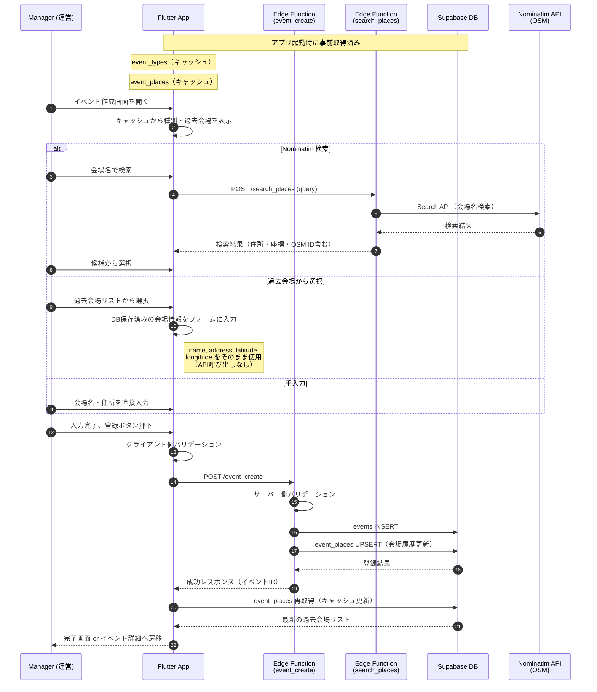

# イベント作成 (Event Create)

## ユーザーフロー / シーケンス



### ステップ説明

1. **事前データ取得（アプリ起動時）**:
   - `event_types`（イベント種別）: アプリ起動時に1度だけ取得し、メモリにキャッシュ。頻繁に更新されないため、アプリ再起動まで保持。
   - `event_places`（過去会場）: アプリ起動時に取得し、メモリにキャッシュ。イベント登録成功時に再取得して更新。
2. **画面初期化（1-2）**: キャッシュ済みの種別・過去会場を即座に表示
3. **会場入力（3-10）**: 3 パターンから選択
   - **Nominatim API 検索**: 会場名で検索し、候補から選択。Search API で住所・座標・OSM ID を一度に取得。
   - **過去会場から選択**: `event_places` に保存済みの情報（name, address, latitude, longitude）をそのままフォームに入力。API 呼び出し不要で高速。
   - **手入力**: 会場名・住所を直接入力。座標は取得しない。
4. **クライアント側バリデーション（12）**: 必須項目をチェック
5. **サーバー側処理（13-17）**: Edge Function でバリデーション後、DB 登録
6. **会場履歴更新（16）**: `event_places` に UPSERT して次回以降の候補に追加
7. **キャッシュ更新（18-19）**: 登録成功後、`event_places` を再取得してキャッシュを更新
8. **完了（20）**: イベント詳細画面へ遷移

## データモデル / API

### 参照テーブル

- [`event_types`](tables.md#event_types) - イベント種別マスタ
- [`events`](tables.md#events) - イベント本体
- [`event_places`](tables.md#event_places) - 会場履歴（再利用候補）

### Edge Function: `event_create`

**エンドポイント**: `POST /event_create`

#### リクエスト

| フィールド | 型 | 必須 | 説明 |
| --- | --- | --- | --- |
| `title` | `string` | ○ | イベントタイトル |
| `event_type_id` | `uuid` | ○ | イベント種別 ID |
| `start_datetime` | `string (ISO8601)` |  | 開始日時 |
| `meeting_datetime` | `string (ISO8601)` |  | 集合日時 |
| `response_deadline_datetime` | `string (ISO8601)` |  | 回答締切日時 |
| `place.name` | `string` | ○ | 会場名 |
| `place.address` | `string` | ○ | 会場住所 |
| `place.osm_id` | `bigint` |  | OSM ID（Nominatim 検索時） |
| `place.osm_type` | `string` |  | OSM type（node/way/relation） |
| `place.latitude` | `number` |  | 緯度 |
| `place.longitude` | `number` |  | 経度 |
| `notes_markdown` | `string` |  | メモ/持ち物（Markdown） |

```json
{
  "title": "練習試合 vs レッドソックス",
  "event_type_id": "uuid-of-event-type",
  "start_datetime": "2025-12-15T10:00:00+09:00",
  "meeting_datetime": "2025-12-15T09:30:00+09:00",
  "response_deadline_datetime": "2025-12-14T18:00:00+09:00",
  "place": {
    "name": "東京ドーム",
    "address": "東京都文京区後楽1-3-61",
    "osm_id": 12345678,
    "osm_type": "way",
    "latitude": 35.7056,
    "longitude": 139.7519
  },
  "notes_markdown": "持ち物: ユニフォーム、グローブ、スパイク"
}
```

#### レスポンス（成功）

```json
{
  "success": true,
  "event": {
    "id": "uuid-of-created-event",
    "title": "練習試合 vs レッドソックス",
    "event_type_id": "uuid-of-event-type",
    "start_datetime": "2025-12-15T10:00:00+09:00",
    "meeting_datetime": "2025-12-15T09:30:00+09:00",
    "response_deadline_datetime": "2025-12-14T18:00:00+09:00",
    "event_place_id": "uuid-of-event-place",
    "notes_markdown": "持ち物: ユニフォーム、グローブ、スパイク",
    "created_at": "2025-12-09T12:00:00Z"
  }
}
```

#### レスポンス（エラー）

| エラーコード | 説明 |
| --- | --- |
| `VALIDATION_ERROR` | 入力値バリデーション失敗 |
| `UNAUTHORIZED` | 認証されていない |
| `EVENT_TYPE_NOT_FOUND` | 指定された event_type_id が存在しない |

```json
{
  "success": false,
  "error": {
    "code": "VALIDATION_ERROR",
    "message": "必須項目が入力されていません"
  }
}
```

### バリデーションルール

| ルール | チェック内容 | 実施場所 |
| --- | --- | --- |
| 必須項目 | title, event_type_id, place.name, place.address | Client + Server |
| 種別存在確認 | event_type_id が event_types に存在すること | Server |

### 会場履歴の UPSERT ロジック

イベント登録成功時、`event_places` テーブルを以下のロジックで更新：

1. **OSM ID がある場合（Nominatim 検索）**: `(osm_type, osm_id)` をキーに UPSERT
2. **手入力の場合**: `place_fingerprint`（会場名 + 住所のハッシュ等）をキーに UPSERT

## 権限・セキュリティ

### RLS ポリシー

event コンテキストのテーブル（`event_types`, `events`, `event_places`）は RLS を設定せず、チームメンバー全員が自由に操作できるようにする。

### Edge Function 認証

- Supabase Auth の JWT トークンを検証
- 認証済みユーザーであれば操作を許可

## エラー・フォールバック

| エラー状況 | ユーザーへの導線 |
| --- | --- |
| バリデーションエラー | 該当フィールドにエラーメッセージを表示、修正を促す |
| ネットワークエラー | リトライボタンを表示 |
| Nominatim API エラー | 「検索できませんでした。手入力してください」と案内 |
| 認証エラー | 「ログインが必要です」と表示 |

## 未決定事項 / Follow-up

- 会場の緯度・経度が取得できない場合の地図表示の扱い（表示しない or 住所から geocoding）
- イベント作成完了後の遷移先（イベント詳細 or イベント一覧）

## 補足情報

### Edge Function: `search_places`
- 役割: Nominatim への検索をサーバー経由で実行し、利用規約を順守する。
- リクエスト: `POST /search_places` with `{ query: string, limit?: number, countryCodes?: string[] }`
- レスポンス: `{ success: true, results: Array<{ placeId, displayName, lat, lon, osmId, osmType, address }> }`
- エラー: `rate_limited` (429), `validation_error` (400), `upstream_error` / `unexpected_response` (502)

### Nominatim API（OpenStreetMap）

Nominatim は OpenStreetMap が提供する無料のジオコーディング API。

**特徴**:

- 完全無料で利用可能
- レート制限: 1秒1リクエスト（公式サーバー使用時）
- User-Agent ヘッダーの設定が必須

**取得できるデータ例**:

```json
{
  "place_id": 123456,
  "osm_type": "way",
  "osm_id": 12345678,
  "lat": "35.7056",
  "lon": "139.7519",
  "display_name": "東京ドーム, 後楽, 文京区, 東京都, 112-0004, 日本",
  "address": {
    "stadium": "東京ドーム",
    "neighbourhood": "後楽",
    "city": "文京区"
  }
}
```

**使用上の注意**:

- 過去会場選択時は DB 保存済みの情報を使用し、API 呼び出しを行わない
- レート制限（1秒1リクエスト）を遵守するため、検索はデバウンス処理を実装
