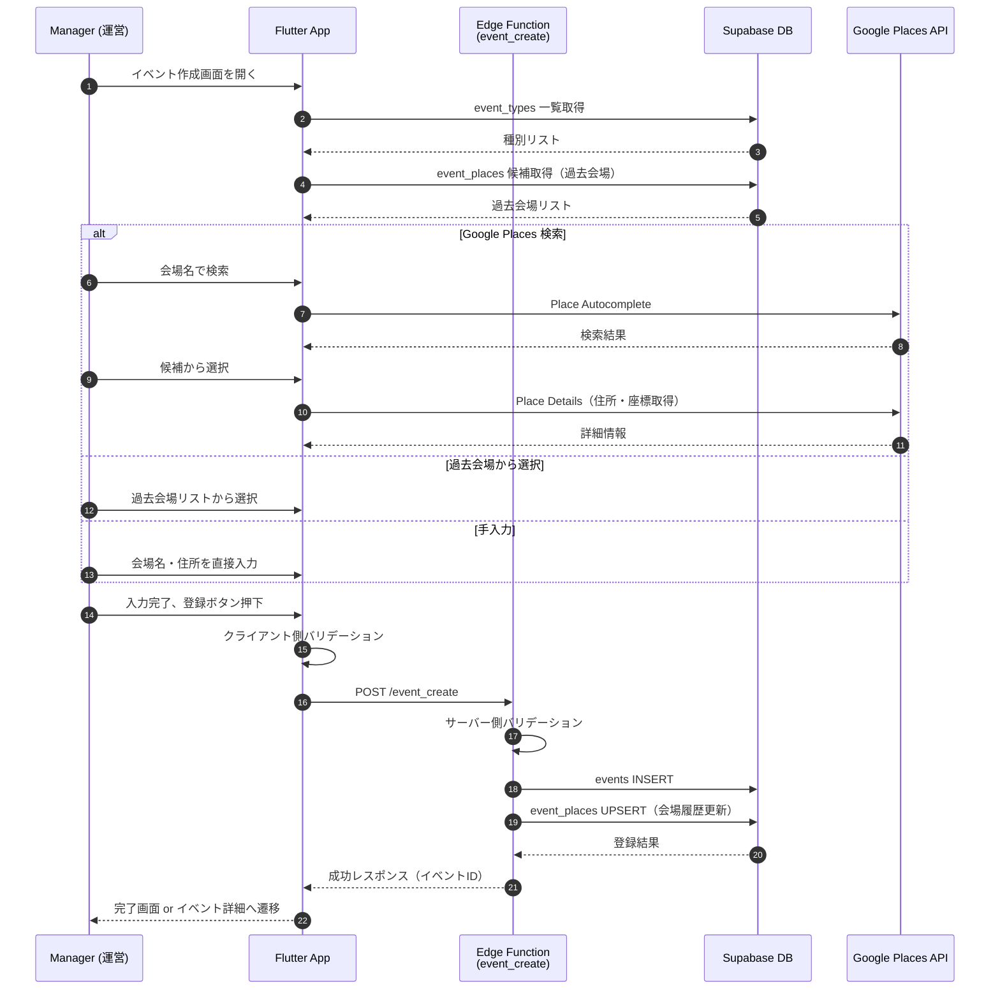

# イベント作成 (Event Create)

## ユーザーフロー / シーケンス



### ステップ説明

1. **画面初期化（1-5）**: イベント種別一覧と過去会場候補を DB から取得
2. **会場入力（6-14）**: 3 パターンから選択
   - Google Places API 検索で候補から選択
   - 過去に使った会場リストから選択
   - 会場名・住所を手入力
3. **クライアント側バリデーション（16）**: 必須項目・日時整合性をチェック
4. **サーバー側処理（17-21）**: Edge Function でバリデーション後、DB 登録
5. **会場履歴更新（20）**: `event_places` に UPSERT して次回以降の候補に追加
6. **完了（22-23）**: イベント詳細画面へ遷移

## データモデル / API

### 参照テーブル

- [`event_types`](tables.md#event_types) - イベント種別マスタ
- [`events`](tables.md#events) - イベント本体
- [`event_places`](tables.md#event_places) - 会場履歴（再利用候補）

### Edge Function: `event_create`

**エンドポイント**: `POST /event_create`

#### リクエスト

| フィールド | 型 | 必須 | 説明 |
| --- | --- | --- | --- |
| `title` | `string` | ○ | イベントタイトル（最長120文字） |
| `event_type_id` | `uuid` | ○ | イベント種別 ID |
| `start_datetime` | `string (ISO8601)` | ○ | 開始日時 |
| `meeting_datetime` | `string (ISO8601)` | ○ | 集合日時 |
| `response_deadline_datetime` | `string (ISO8601)` |  | 回答締切日時 |
| `place.name` | `string` | ○ | 会場名 |
| `place.address` | `string` | ○ | 会場住所 |
| `place.google_place_id` | `string` |  | Google Place ID |
| `place.latitude` | `number` |  | 緯度 |
| `place.longitude` | `number` |  | 経度 |
| `notes_markdown` | `string` |  | メモ/持ち物（Markdown） |

```json
{
  "title": "練習試合 vs レッドソックス",
  "event_type_id": "uuid-of-event-type",
  "start_datetime": "2025-12-15T10:00:00+09:00",
  "meeting_datetime": "2025-12-15T09:30:00+09:00",
  "response_deadline_datetime": "2025-12-14T18:00:00+09:00",
  "place": {
    "name": "東京ドーム",
    "address": "東京都文京区後楽1-3-61",
    "google_place_id": "ChIJ...",
    "latitude": 35.7056,
    "longitude": 139.7519
  },
  "notes_markdown": "持ち物: ユニフォーム、グローブ、スパイク"
}
```

#### レスポンス（成功）

```json
{
  "success": true,
  "event": {
    "id": "uuid-of-created-event",
    "title": "練習試合 vs レッドソックス",
    "event_type_id": "uuid-of-event-type",
    "start_datetime": "2025-12-15T10:00:00+09:00",
    "meeting_datetime": "2025-12-15T09:30:00+09:00",
    "response_deadline_datetime": "2025-12-14T18:00:00+09:00",
    "place_name": "東京ドーム",
    "place_address": "東京都文京区後楽1-3-61",
    "place_google_id": "ChIJ...",
    "place_latitude": 35.7056,
    "place_longitude": 139.7519,
    "notes_markdown": "持ち物: ユニフォーム、グローブ、スパイク",
    "created_at": "2025-12-09T12:00:00Z"
  }
}
```

#### レスポンス（エラー）

| エラーコード | 説明 |
| --- | --- |
| `VALIDATION_ERROR` | 入力値バリデーション失敗 |
| `UNAUTHORIZED` | 認証されていない |
| `FORBIDDEN` | manager ロールではない |
| `EVENT_TYPE_NOT_FOUND` | 指定された event_type_id が存在しない |

```json
{
  "success": false,
  "error": {
    "code": "VALIDATION_ERROR",
    "message": "集合日時は開始日時以前である必要があります"
  }
}
```

### バリデーションルール

| ルール | チェック内容 | 実施場所 |
| --- | --- | --- |
| 必須項目 | title, event_type_id, start_datetime, meeting_datetime, place.name, place.address | Client + Server |
| 文字数 | title: 最長120文字 | Client + Server |
| 日時整合性 | `meeting_datetime <= start_datetime` | Client + Server |
| 日時整合性 | `response_deadline_datetime <= start_datetime`（設定時） | Client + Server |
| 種別存在確認 | event_type_id が event_types に存在すること | Server |
| 権限 | 呼び出し元ユーザーが manager ロールであること | Server |

### 会場履歴の UPSERT ロジック

イベント登録成功時、`event_places` テーブルを以下のロジックで更新：

1. **Google Place ID がある場合**: `place_google_id` をキーに UPSERT
2. **手入力の場合**: `place_fingerprint`（会場名 + 住所のハッシュ等）をキーに UPSERT
3. **更新内容**: `usage_count + 1`、`last_used_datetime = now()`

## 権限・セキュリティ

### RLS ポリシー

| テーブル | 操作 | 許可ロール |
| --- | --- | --- |
| `event_types` | SELECT | member, manager |
| `event_types` | INSERT/UPDATE/DELETE | manager |
| `events` | SELECT | member, manager |
| `events` | INSERT/UPDATE/DELETE | manager |
| `event_places` | SELECT | manager（候補表示用） |
| `event_places` | INSERT/UPDATE | manager |

### Edge Function 認証

- Supabase Auth の JWT トークンを検証
- `users` テーブルから role を取得し、`manager` であることを確認
- 不正な場合は 403 Forbidden を返却

### Google Places API キー管理

- API キーは Supabase Secret Manager で管理
- Flutter 側の API キーは Android/iOS のネイティブ設定で制限（リファラー/バンドルID）

## エラー・フォールバック

| エラー状況 | ユーザーへの導線 |
| --- | --- |
| バリデーションエラー | 該当フィールドにエラーメッセージを表示、修正を促す |
| ネットワークエラー | リトライボタンを表示 |
| Google Places API エラー | 「検索できませんでした。手入力してください」と案内 |
| 権限エラー | 「この操作には運営権限が必要です」と表示 |

## 未決定事項 / Follow-up

- Google Places API の利用料金・クォータ管理方針（無料枠で十分か要検証）
- 会場の緯度・経度が取得できない場合の地図表示の扱い（表示しない or 住所から geocoding）
- イベント作成完了後の遷移先（イベント詳細 or イベント一覧）
