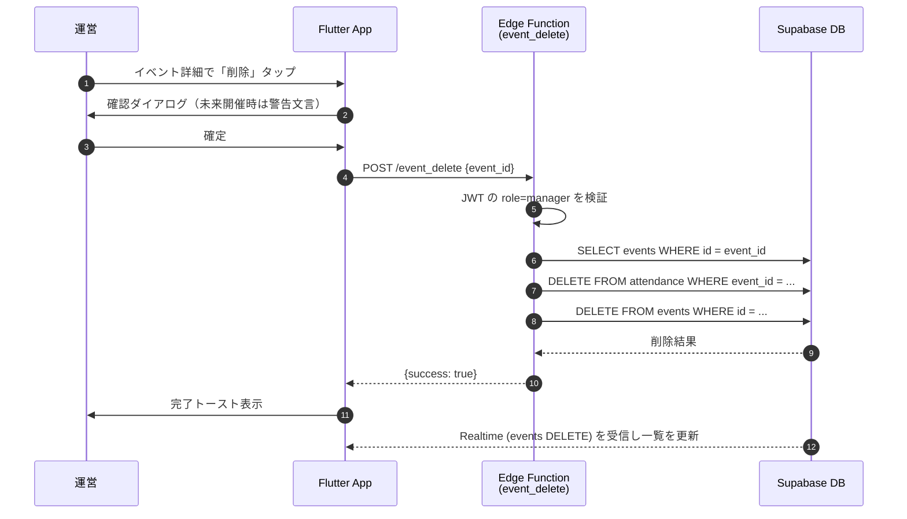

# イベント削除 (Event Delete)

## ユーザーフロー / シーケンス

- 過去イベントも削除可能（制限なし）。
- 通知配信は行わない。

## データモデル / API
- 参照・更新テーブル: [`events`](tables.md#events), [`attendance`](../attendance/tables.md#attendance)
- Edge Function: `POST /event_delete`
  - **Request**
    - `event_id` (`uuid`, 必須)
  - **Success Response**
    ```json
    { "success": true }
    ```
  - **Error Response**
    - `UNAUTHORIZED` (401): 認証なし
    - `FORBIDDEN` (403): `role != manager`
    - `NOT_FOUND` (404): event_id が存在しない
    - `DB_ERROR` (500): DB 障害

## 権限・セキュリティ
- `events` / `attendance` は RLS なし方針を踏襲。削除権限は Edge Function 内で `jwt.role = 'manager'` を必須チェック。
- 入力バリデーション: `event_id` の UUID 形式検証 + DB 存在確認。

## エラー・フォールバック
- `NOT_FOUND`: 「削除済みまたは存在しません」トースト表示後、一覧へ戻る。
- `UNAUTHORIZED` / `FORBIDDEN`: セッション再取得を促す。操作は中断。
- `DB_ERROR`: 再試行ボタンを表示し、複数回失敗でフィードバック導線。
- Realtime 受信失敗時は手動リロード（プルリフレッシュ）で復旧できる UI を用意。

## 未決定事項 / Follow-up
- なし。
