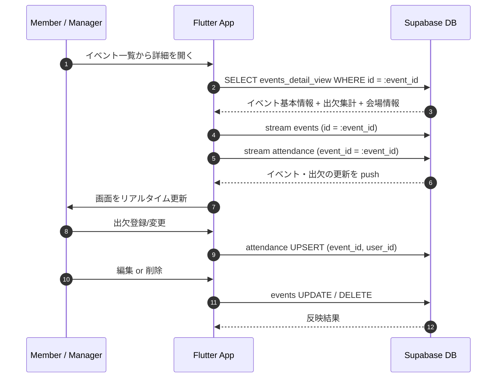

# イベント詳細 (Event Detail)

## ユーザーフロー / シーケンス

- コメント機能は初期スコープ外。出欠登録・イベント編集/削除に集中。

## データモデル / API
- 参照テーブル: [`events`](tables.md#events), [`event_places`](tables.md#event_places), [`event_types`](tables.md#event_types), `attendance`（別途 attendance/tables.md で定義予定）。
- 取得構成: 初回は `events_detail_view` で 1 回取得し、以降 `events` と `attendance` を Realtime 購読。

### ビュー: events_detail_view（新規追加予定）
- 目的: 詳細画面で必要な情報を 1 クエリで返し、クライアント処理を単純化する。
- 列案:
  - イベント: `id`, `title`, `event_type_id`, `event_type_name`, `start_datetime`, `meeting_datetime`, `response_deadline_datetime`, `notes_markdown`, `created_at`, `updated_at`
  - 会場: `event_place_id`, `place_name`, `place_address`, `latitude`, `longitude`, `osm_id`, `osm_type`
  - 出欠集計: `attending_count`, `absent_count`, `pending_count`, `unanswered_count`
- 作り方: `events` を主、`event_types`/`event_places` を LEFT JOIN、`attendance_summary_view` と結合。
- 想定利用: `supabase_flutter` の `select().single()` で取得。クライアント側で Google Maps ディープリンク/マーカーを生成。

### ビュー: attendance_summary_view（新規追加予定）
- 目的: ステータス別人数カウントを全メンバーが閲覧できるようにする。
- 列: `event_id`, `attending_count`, `absent_count`, `pending_count`, `unanswered_count`, `updated_at`。
- 集計方法: `attendance` テーブルを `status` 列で `COUNT FILTER`、未回答は `active` な `user` 総数 − 回答済みの合計で算出。
- セキュリティ: `SECURITY DEFINER` + `auth.uid()` 無依存で集計し、個人情報は含めない（RLS の有無にかかわらず集計値を返す）。

### 地図連携方針
- 検索・座標取得: Nominatim (OSM) を利用（イベント作成時に実装済み）。
- 表示: クライアントは `google_maps_flutter` でピン表示し、外部アプリへは Google Maps Deeplink（lat/lng ベース）を生成。`place_id` は保持しない運用。
- 座標なしの場合は地図セクションを非表示にし、住所のみ表示。

### 出欠登録 API
- クライアントで `attendance` に `upsert`（キー: `event_id`, `user_id`）。
- ステータスは `participating / absent / pending`（文言は UI で管理）。

## 権限・セキュリティ
- イベント編集/削除: 全メンバーが実行可能とする（運用コスト優先）。誤操作対策として確認ダイアログを必須にする。
- 出欠閲覧: 集計値は全員閲覧可。個票は `attendance` テーブルの RLS 方針に従う（自分の行のみ SELECT、manager は全件）。
- RLS: イベント関連テーブルは RLS なし方針を踏襲。`attendance_summary_view` は Security Definer で RLS 影響を受けず集計値を返す。

## エラー・フォールバック
- データ取得失敗: リトライボタン付きエンプティ表示。リアルタイム購読失敗時は手動更新導線を提示。
- 地図表示失敗: ディープリンクボタンのみ残し、ピン表示はスキップ。
- 出欠更新失敗: スナックバーでエラー表示し、楽観更新は行わない。

## 未決定事項 / Follow-up
- 未回答カウント算出に利用する「メンバー総数」の定義を `user` テーブルで良しとするか、別途ロスターを設けるか要確認。
- `attendance` テーブルの列定義（RLS ポリシー含む）を attendance/tables.md に追記する。
- `events_detail_view` / `attendance_summary_view` 追加用の Supabase マイグレーションファイルを作成する。
- 編集・削除時の通知（Edge Functions）を送るか否か。送る場合はイベント更新設計（event_edit.md）の通知フローを再利用する。
