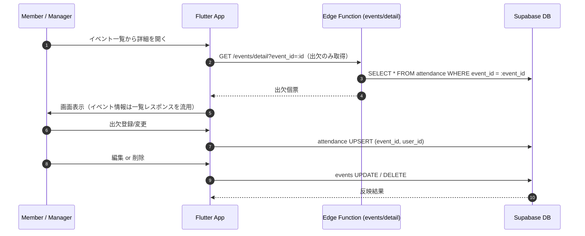

# イベント詳細 (Event Detail)

## ユーザーフロー / シーケンス

- コメント機能は初期スコープ外。出欠登録・イベント編集/削除に集中。

## データモデル / API
- 参照テーブル: [`events`](tables.md#events), [`event_places`](tables.md#event_places), [`event_types`](tables.md#event_types), `attendance`（別途 attendance/tables.md で定義予定）。
- 取得構成: イベント基本情報はイベント一覧 (`events/list`) のレスポンスを流用し、詳細画面では追加のイベント取得を行わない。出欠のみ Edge Function `events/detail` で取得。

### 一覧レスポンスで保持するイベント情報
- 列: `id`, `title`, `event_type_id`, `event_type_name`, `start_datetime`, `meeting_datetime`, `response_deadline_datetime`, `event_place_id`, `event_place_name`, `event_place_google_maps_url_normalized`, `notes_markdown`, `created_at`, `updated_at`
- 生成元: `events_recent_view`（詳細で必要な列をすべて含めるよう拡張する）。
- 想定利用: Edge Function `GET /events/list` のレスポンスとして返却。詳細画面はこのデータを引数で受け取り表示する。

### Edge Function: events/detail (GET)
- 認証必須（Bearer トークン）。サービスロールキーで Supabase へ接続しつつ、リクエストヘッダの JWT から `user_id` を検証する。
- 入力: `event_id`（必須, UUID, query parameter）。
- 処理: `attendance` を `event_id` で全件取得し、`user_detail`（`display_name`, `avatar_url`）を JOIN してレスポンスに含める。イベント情報はレスポンスに含めない（一覧から受け取る）。
- 出力例:
  ```json
  {
    "attendance": [
      {
        "id": "attendance-uuid",
        "memberId": "user-uuid",
        "displayName": "田中太郎",
        "avatarUrl": "https://example.com/avatar.png",
        "status": "attending",
        "comment": "OK",
        "updatedAt": "2025-12-28T04:50:00Z"
      }
    ]
  }
  ```

### 出欠データ取得方針
- 個票表示を優先するため、Edge Function `events/detail` 内で `attendance` を `event_id = :event_id` で取得し、全件を返す。ステータス別の並び替え・フィルタリング・人数集計はアプリ側の責務とする。
- 初回ロード: Edge Function のレスポンスに含める（`user_id`, `status`, `comment`, `updated_at` など必要列のみ）。
- 更新: 出欠更新後は `GET /events/detail` を再取得して最新表示とする（Realtime は利用しない）。

### 地図連携 / WebView プレビュー方針
- 場所データ: `event_places.google_maps_url_normalized` のみ保持し、座標は保持しない。
- 表示: `event_place_google_maps_url_normalized` を `InAppWebView`（既存の場所登録画面と同じコンポーネント）で読み込み、地図プレビューを表示する。外部アプリ起動は同 URL を `launchUrl` で開く導線をボタンで提供。
- 非表示条件: URL が空の場合は地図セクション自体を非表示。
- エラー時: WebView 読み込み失敗時はプレビューを非表示に切り替え、外部ブラウザで開くボタンのみ残す。

### 出欠登録 API
- クライアントで `attendance` に `upsert`（キー: `event_id`, `user_id`）。
- ステータスは `participating / absent / pending`（文言は UI で管理）。

## 権限・セキュリティ
- イベント編集/削除: 全メンバーが実行可能とする（運用コスト優先）。誤操作対策として確認ダイアログを必須にする。
- 出欠閲覧: Edge Function でサービスロールキーを用いて `attendance` を取得し、認証済みユーザーに全件を返す（アプリ直アクセスでは個票取得不可）。
- RLS: イベント関連テーブルは RLS なし方針を踏襲。`attendance` は RLS ありだが Edge Function が代理取得するためクライアントの直接 SELECT / Realtime は行わない。

## エラー・フォールバック
- データ取得失敗: リトライボタン付きエンプティ表示。リアルタイム購読失敗時は手動更新導線を提示。
- 地図表示失敗: WebView を非表示に切り替え、外部ブラウザで開くボタンのみ残す。
- 出欠更新失敗: スナックバーでエラー表示し、楽観更新は行わない。

## 未決定事項 / Follow-up
- 未回答カウント算出に利用する「メンバー総数」の定義を `user` テーブルで良しとするか、別途ロスターを設けるか要確認。
- `attendance` テーブルの列定義（RLS ポリシー含む）を attendance/tables.md に追記する。
- `events_detail_view` 追加用の Supabase マイグレーションファイルを作成する。
- Edge Function `events/detail` を実装・デプロイし、Flutter 側の取得ロジックを置き換える。
- 編集・削除時の通知（Edge Functions）を送るか否か。送る場合はイベント更新設計（event_edit.md）の通知フローを再利用する。
