# イベント編集 (Event Edit)

## ユーザーフロー / シーケンス

```mermaid
sequenceDiagram
    autonumber
    participant Manager as Manager / Member
    participant App as Flutter App
    participant Edge as Edge Function<br>(event_update)
    participant DB as Supabase DB

    Manager->>App: イベント詳細から編集を開く<br>(一覧レスポンスを引き継ぎ初期表示)
    App->>App: event_types / event_places をキャッシュから展開<br>不足時は再取得
    Manager->>App: 入力値を編集
    App->>App: クライアントバリデーション（必須/時系列/文字数）
    App->>Edge: POST /event_update (event_id, payload)
    Edge->>Edge: JWT 検証・入力バリデーション
    Edge->>DB: events UPDATE (title, type, datetime, place, notes)<br>updated_user = jwt.sub
    DB-->>Edge: 更新結果を返却
    Edge-->>App: 成功レスポンス（更新後イベント）
    App->>App: アプリ側で保持しているイベント一覧キャッシュを更新<br>(該当行を置き換えるか再取得)
    App-->>Manager: 完了トースト表示 / 詳細に戻る
```


### ステップ説明
1. 詳細画面から遷移し、一覧で取得済みのイベント情報を初期値としてフォームにセットする。event_types / event_places は起動時キャッシュを再利用し、欠損時のみ再取得。
2. クライアントで必須/整合性チェック（タイトル、種別、時刻関係、締切<=開始など）を実施。create と同一ルールを適用。
3. Edge Function `event_update` に送信。Edge 側で JWT 検証・サーバーバリデーションを行い、`events` を UPDATE。`updated_user` は Edge 側で `jwt.sub` をセットし、`updated_at` は DB トリガで自動更新。
4. 更新後はクライアントが保持するイベント一覧データを最新化（再取得または該当行のみ置換）し、詳細画面へ戻す。

## データモデル / API

- 参照テーブル: [`events`](tables.md#events), [`event_types`](tables.md#event_types), [`event_places`](tables.md#event_places)
- 更新対象: `title`, `event_type_id`, `start_datetime`, `meeting_datetime`, `response_deadline_datetime`, `event_place_id`, `notes_markdown`, `updated_user`

### Edge Function: `event_update` (POST)

**Request**
```json
{
  "event_id": "event-uuid",
  "title": "練習試合 vs ブルージェイズ",
  "event_type_id": "uuid-type",
  "start_datetime": "2026-02-11T10:00:00+09:00",
  "meeting_datetime": "2026-02-11T09:30:00+09:00",
  "response_deadline_datetime": "2026-02-10T18:00:00+09:00",
  "event_place_id": "uuid-place",
  "notes_markdown": "持ち物: 帽子・ユニフォーム"
}
```
- Edge 内で `updated_user = jwt.sub` を設定するため、クライアントから `updated_user` は送らない。
- 部分更新ではなく現行値を含む全フィールドを送信し、一貫性を担保。

**Success Response**
```json
{
  "success": true,
  "event": {
    "id": "event-uuid",
    "title": "練習試合 vs ブルージェイズ",
    "event_type_id": "uuid-type",
    "start_datetime": "2026-02-11T10:00:00+09:00",
    "meeting_datetime": "2026-02-11T09:30:00+09:00",
    "response_deadline_datetime": "2026-02-10T18:00:00+09:00",
    "event_place_id": "uuid-place",
    "notes_markdown": "持ち物: 帽子・ユニフォーム",
    "updated_at": "2026-01-05T03:00:00Z",
    "updated_user": "auth-user-uuid"
  }
}
```

**Error Response**
- `UNAUTHORIZED` (401): JWT 不正
- `VALIDATION_ERROR` (400): 入力値不備
- `NOT_FOUND` (404): event_id が存在しない
- `DB_ERROR` (500): DB 障害

### バリデーション（共通で再利用）
| ルール | 内容 | 実施場所 |
| --- | --- | --- |
| 必須 | `title`, `event_type_id` | Client + Server |
| 時系列 | `meeting_datetime < start_datetime` | Client |
| 締切 | `response_deadline_datetime <= start_datetime` | Client |
| 文字数 | `title` 最大 120 文字、`notes_markdown` は 4000 文字目安 | Client |
| 存在確認 | `event_type_id` / `event_place_id` が存在すること | Server (update 時に FK 未使用のため手動確認) |

## 権限・セキュリティ
- イベント関連テーブルは RLS 無効方針。Edge Function 内で JWT を検証し、認証済みユーザーであれば更新を許可（運用コスト優先）。アプリ側で「運営のみ編集可」としたい場合は `user` 情報に基づく UI 制御を行う（DB 制約は設けない）。
- Edge 側で `updated_user = jwt.sub` を必ず設定し監査を担保。

## エラー・フォールバック
- バリデーションエラー: フィールド単位でエラーメッセージを表示し送信を中断。
- 対象イベントなし / 競合: `rowCount=0` の場合は「イベントが削除された可能性があります」と表示し一覧へ戻す。
- ネットワーク・Supabase エラー: リトライ導線を提示。ローカル楽観更新は行わない。

## 未決定事項 / Follow-up
- なし（必要に応じて追記）
