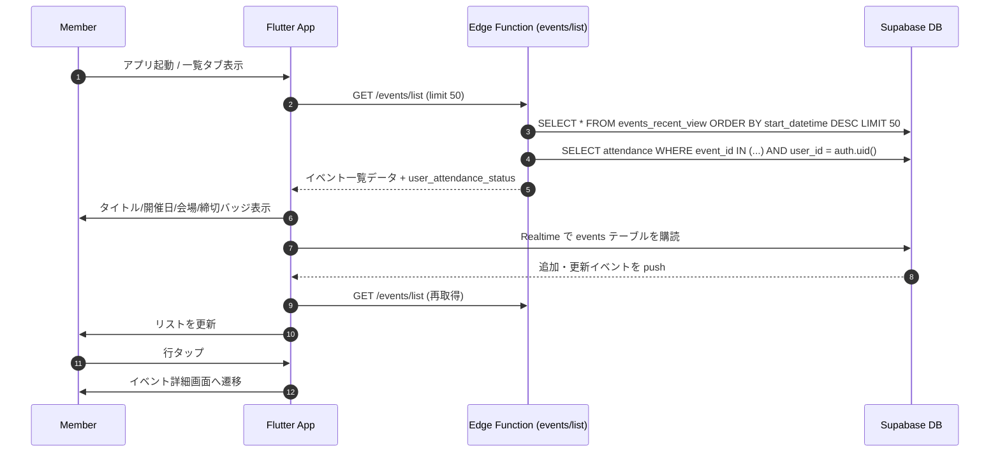

# イベント一覧 (Event List)

メンバーと運営が同一 UI で直近イベントを確認し、出欠判断を素早く行うための一覧画面。取得は Edge Function (`events/list` GET) 経由で行う。

## ユーザーフロー / シーケンス

- 追加取得は行わず 50 件までで打ち止め（無限スクロールは不要）。
- 出欠未回答のメンバーにはバッジを表示し、タップで詳細へ誘導。

## データモデル / API
- 参照テーブル: `events`, `event_places`, `event_types`。公開ビュー: `events_recent_view`（下記列を持つ）。
- ビュー列: `id`, `title`, `event_type_id`, `event_type_name`, `start_datetime`, `meeting_datetime`, `response_deadline_datetime`, `event_place_id`, `place_name`, `created_at`, `updated_at`。
- 抽出条件: `start_datetime >= now() - interval '1 day'`（DB タイムゾーン = UTC 基準）。表示期間は開始から 1 日間延長。
- 並び替え: `start_datetime` 降順。取得件数: `limit 50`（Edge Function 側で `ORDER BY ... DESC LIMIT 50` を適用）。
- 出欠バッジ用: Edge Function 内で `attendance` を `event_id` IN (...) かつ `user_id = auth.uid()` で取得し、`user_attendance_status` を `participating|absent|pending|unanswered` のいずれかで付与する（ビューには含めない）。
- Realtime: `supabase_flutter` の `stream()` で `events` テーブルを購読。push 受信時に `GET /events/list` を再リクエストして最新状態を反映。
- 詳細画面への遷移時は `id` を引き渡し、`event_detail` の設計に委譲。

## 権限・セキュリティ
- `events`/`event_places`/`event_types` は RLS なし方針を踏襲。
- `events/list` Edge Function は認証必須（Bearer トークン）で、`auth.uid()` を用いて `attendance` を取得する。

## エラー・フォールバック
- データ取得失敗時はリトライボタン付きのエンプティ状態を表示する（詳細文言は UI 未確定）。
- Realtime に加え、手動更新（プルリフレッシュ）でも再取得できる導線を提供。

## 未決定事項 / Follow-up
- なし。
