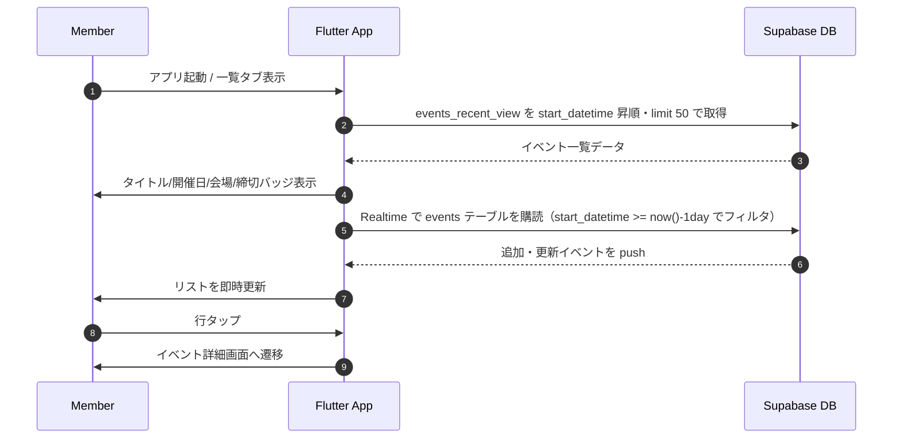

# イベント一覧 (Event List)

メンバーと運営が同一 UI で直近イベントを確認し、出欠判断を素早く行うための一覧画面。

## ユーザーフロー / シーケンス

- 追加取得は行わず 50 件までで打ち止め（無限スクロールは不要）。
- 出欠未回答のメンバーにはバッジを表示し、タップで詳細へ誘導。

## データモデル / API
- 参照テーブル: `events`、`event_places`。公開ビュー: `events_recent_view`。
- 想定フィールド（ビュー列）: `id`, `title`, `start_datetime`, `response_deadline_datetime`, `place_name`, `event_type_id`。
- 抽出条件: `start_datetime >= now() - interval '1 day'`（開始から 1 日間は表示し続ける）。
- 並び替え: `start_datetime` 昇順。取得件数: `limit 50`。
- Realtime: `supabase_flutter` の `stream()` で `events` テーブルを購読し、 `start_datetime >= now() - interval '1 day'` でフィルタして insert/update を反映。ビューは単発取得に利用。
- 詳細画面への遷移時は `id` を引き渡し、`event_detail` の設計に委譲。

## 権限・セキュリティ
- 本コンテキストのテーブルには RLS を設定しない方針。ビューも同様に全メンバー閲覧可。
- DB 直叩きは行わず Supabase クライアント経由でアクセスする。

## エラー・フォールバック
- データ取得失敗時はリトライボタン付きのエンプティ状態を表示する（詳細文言は UI 未確定）。
- Realtime に加え、手動更新（プルリフレッシュ）でも再取得できる導線を提供。

## 未決定事項 / Follow-up
- なし。
