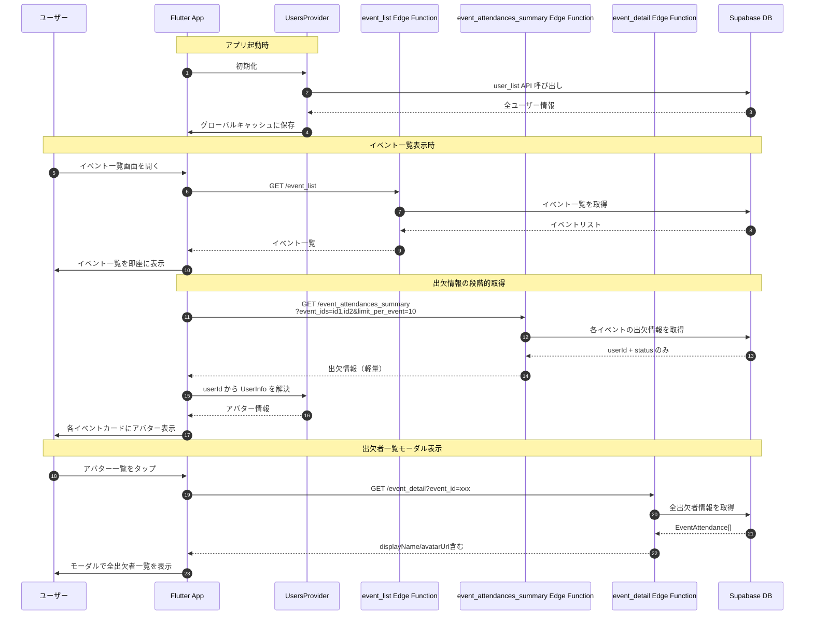

# イベント一覧出欠者表示 (Event List Attendances)

## ユーザーフロー / シーケンス



### フロー説明

1. **アプリ起動時**: UsersProvider が user_list API を呼び出し、全ユーザー情報（約50名、7.5KB）をグローバルキャッシュに保存
2. **イベント一覧表示**: event_list API を呼び出してイベント一覧を取得
3. **即座にUI表示**: イベント一覧を待たずに画面を描画（既存機能）
4. **段階的出欠情報取得**: イベント一覧取得成功後、自動的に event_attendances_summary API を呼び出し
5. **軽量レスポンス**: API は userId と status のみ返却（約20KB、50イベント × 10名想定）
6. **アバター解決**: UsersProvider から getUserById() で各 userId のアバター情報を取得
7. **UI再描画**: 各イベントカードにアバター一覧（最大10名 + 残数バッジ）を表示
8. **モーダル表示**: アバターをタップすると event_detail API で全出欠者情報を取得し、モーダルで詳細表示

## データモデル / API

### 関連テーブル

[attendance テーブル](./tables.md#attendance-テーブル) を参照。

### API 1: event_attendances_summary

**Edge Function**: `event_attendances_summary`

**エンドポイント**: `GET /event_attendances_summary`

**リクエスト**:
```
Query Parameters:
- event_ids: string (カンマ区切りのイベントID、必須)
- limit_per_event: number (各イベントの表示上限、デフォルト: 10)
```

**レスポンス**:
```json
{
  "attendances": {
    "<event_id_1>": [
      {
        "userId": "<user_id>",
        "status": "attending" | "not_attending" | "pending"
      }
    ],
    "<event_id_2>": [...]
  }
}
```

**処理フロー**:
1. クエリパラメータのバリデーション（event_ids 必須、limit_per_event は数値）
2. 各 eventId ごとに attendance テーブルをクエリ
   - `status` 優先度: attending > pending > not_attending
   - `updated_at` 降順
   - `LIMIT limit_per_event`
3. userId と status のみを返却（displayName や avatarUrl は含まない）

**エラーコード**:
- `400`: パラメータバリデーションエラー
- `401`: 認証エラー
- `500`: サーバーエラー

### API 2: event_detail（既存）

**Edge Function**: `event_detail`

モーダル表示時に全出欠者情報を取得するために使用。詳細は [event_detail.md](./event_detail.md) を参照。

### API 3: user_list（既存）

**Edge Function**: `user_list`

アプリ起動時に全ユーザー情報をキャッシュするために使用。詳細は [../auth/user_list.md](../auth/user_list.md) を参照（該当ドキュメントがない場合は今後作成予定）。

### フロントエンドモデル

#### AttendanceSummary
```dart
class AttendanceSummary {
  final String userId;
  final AttendanceSummaryStatus status;
}

enum AttendanceSummaryStatus {
  attending,
  notAttending,
  pending,
}
```

#### UserInfo（グローバルキャッシュ）
```dart
class UserInfo {
  final String userId;
  final String displayName;
  final String? avatarUrl;
  final String status;
  final DateTime? lastLoginDatetime;
  final String role;
  final DateTime createdAt;
}
```

#### UsersState
```dart
class UsersState {
  final UsersStatus status;
  final List<UserInfo> users;
  final String? errorMessage;

  UserInfo? getUserById(String userId);
}
```

### データフロー設計方針

**グローバルユーザキャッシュ採用理由**:
1. **API軽量化**: 出欠情報 API は userId + status のみ返す（60%データ削減）
2. **スケーラビリティ**: 50イベントでも API リクエスト数は 2 回（イベント一覧 → 出欠情報一括）
3. **他機能での再利用**: ユーザー情報キャッシュは他画面でも活用可能
4. **メモリ効率**: 全ユーザー約50名 × 150バイト = 7.5KB（非常に軽量）

## 権限・セキュリティ

### 認証
- event_attendances_summary Edge Function は JWT 認証必須（`verify_jwt: true`）
- authMiddleware() による認証チェック

### RLS
- attendance テーブルの既存 RLS ポリシーに準拠
- 読み取り権限: 認証済みユーザー全員

### データ保護
- API レスポンスは最小限の情報のみ（userId + status）
- アバター情報はクライアント側のキャッシュから解決
- 個人情報（displayName、avatarUrl）は event_detail API またはグローバルキャッシュから取得

## UI/UX 仕様

### イベント一覧画面のアバター表示

**表示位置**: 各イベントカードの下部

**表示内容**:
- People アイコン（16px）
- アバタースタック（最大10名、重なり表示、左から16pxずつオフセット）
- 残数バッジ（10名を超える場合、"+N" 形式）

**アバターデザイン**:
- サイズ: 24px × 24px（円形）
- ステータス別枠色:
  - 参加（attending）: 緑
  - 欠席（not_attending）: 赤
  - 保留（pending）: オレンジ
- 枠幅: 2px
- フォールバック: アバター画像がない場合は person アイコン

**ローディング状態**:
- 出欠情報取得中: People アイコン + LinearProgressIndicator（幅100px）
- イベント一覧自体の表示は遅延しない

**インタラクション**:
- アバター一覧全体をタップ可能（InkWell）
- タップ時: 出欠者一覧モーダルを表示

### 出欠者一覧モーダル

**表示形式**: BottomSheet（画面高さの70%）

**ヘッダー**:
- タイトル: "出欠一覧"
- 閉じるボタン（×アイコン）

**サマリーカード**:
- 出席 / 保留 / 欠席 それぞれの人数を大きく表示
- 色分け: 緑 / オレンジ / 赤

**出欠者リスト**:
- セクション分け:
  1. 出席者セクション
  2. 保留セクション
  3. 欠席者セクション
- 各セクションヘッダー:
  - 左側に色付きバー（4px幅）
  - ステータス名 + 人数バッジ
- 各メンバータイル:
  - アバター（48px、ステータス色枠付き）
  - 表示名（太字）
  - コメント（2行まで表示、以降は省略）

**ローディング状態**:
- CircularProgressIndicator + "出欠情報を取得中..." テキスト

**エラー状態**:
- エラーアイコン（64px）
- "エラーが発生しました" タイトル
- エラーメッセージ
- "再試行" ボタン

**空状態**:
- People アイコン（64px）
- "まだ回答がありません" テキスト

## エラー・フォールバック

### ユーザー情報取得失敗（アプリ起動時）
- **エラーハンドリング**: UsersProvider のエラー状態に設定
- **ユーザー影響**: エラーメッセージは表示しない（ログのみ記録）
- **フォールバック**: 他機能は継続動作、アバター表示時は person アイコンを使用

### 出欠情報取得失敗
- **エラーハンドリング**: EventListState の attendanceErrorMessage に設定
- **ユーザー影響**: アバター一覧を非表示（イベント一覧自体は正常表示）
- **フォールバック**: ログに記録、ユーザーへはエラー通知なし

### ユーザー情報解決失敗（userId突合失敗）
- **エラーハンドリング**: getUserById() が null を返す
- **ユーザー影響**: フォールバックアイコン（person）を表示
- **フォールバック**: アプリは正常動作を継続

### モーダル内の出欠情報取得失敗
- **エラーハンドリング**: モーダル内にエラー状態を表示
- **ユーザー影響**: エラーメッセージ + "再試行" ボタン
- **フォールバック**: ユーザーは再試行またはモーダルを閉じることが可能

### 画像ロード失敗
- **エラーハンドリング**: Image.network の errorBuilder
- **ユーザー影響**: フォールバックアイコン（person）を表示
- **フォールバック**: エラー表示なし、アプリは正常動作

## パフォーマンス考慮事項

### データ量見積もり
- **ユーザー情報キャッシュ**: 約50名 × 150バイト = 7.5KB（アプリ起動時1回のみ）
- **イベント一覧**: 既存と同じ
- **出欠情報**: 50イベント × 10名 × 40バイト = 20KB（既存案の60%削減）

### レスポンスタイム
- **アプリ起動時**: UsersProvider 初期化で +0.3〜0.5秒（1回のみ）
- **イベント一覧**: 既存と同じ（遅延なし）
- **出欠情報**: +0.3〜0.5秒（段階的表示のため影響小）

### キャッシュ戦略
1. **ユーザー情報キャッシュ**:
   - アプリ起動時に UsersProvider で全ユーザー情報を取得
   - グローバルキャッシュとして保持（メモリ消費: 約7.5KB）
   - アプリ終了まで保持、再起動時に再取得

2. **出欠情報キャッシュ**:
   - EventListState 内で attendanceSummaries を保持
   - リフレッシュ時のみ再取得

### 最適化ポイント
- API レスポンスが軽量（アバター情報を含まない）
- ユーザー情報は他の画面でも再利用可能
- ネットワーク負荷が低減（JOINなし、必要最小限のデータのみ）

## 未決定事項 / Follow-up

### 完了済み
- ✅ グローバルユーザキャッシュの実装
- ✅ event_attendances_summary API の実装
- ✅ イベント一覧へのアバター表示実装
- ✅ 出欠者一覧モーダル実装

### 今後の検討事項
- [ ] 手動テスト実施（ローカル環境での動作確認）
- [ ] パフォーマンス測定（実際のレスポンスタイム計測）
- [ ] アニメーション追加（オプション）
  - アバター表示時のフェードイン
  - モーダル表示時のスムーズなスライドアップ
- [ ] アクセシビリティ対応
  - セマンティックラベルの追加
  - スクリーンリーダー対応
