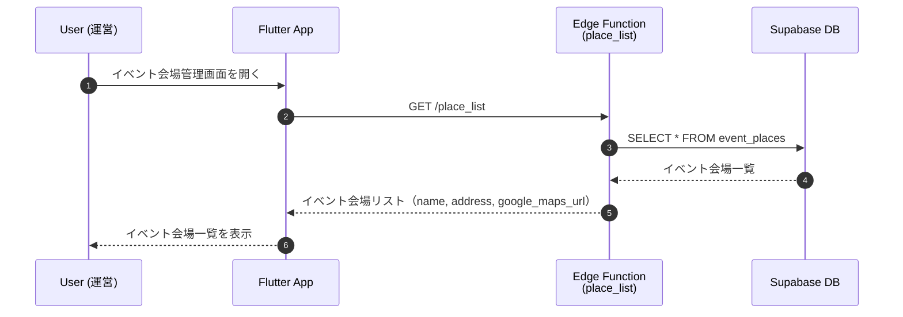
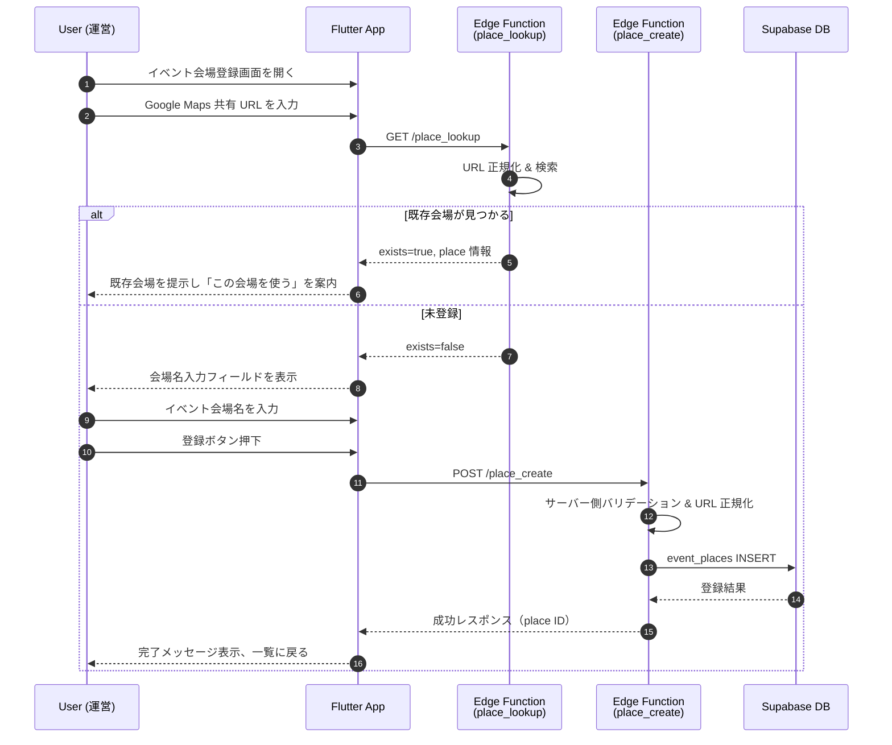
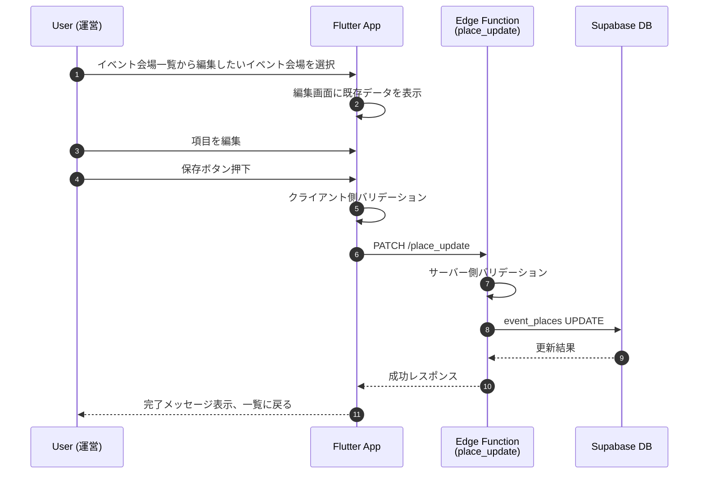
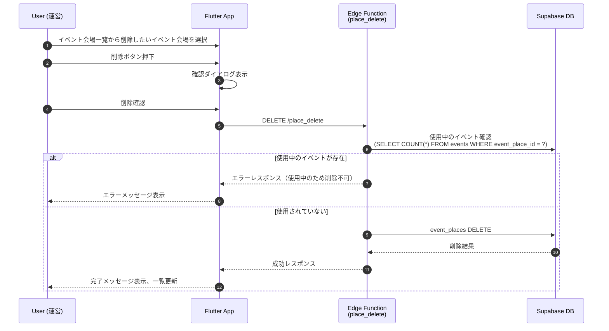

# イベント会場登録・管理 (Place Registration & Management)

## 概要

イベント作成時に使用するイベント会場を事前に登録・管理する機能。運営メンバーがイベント会場を登録し、イベント作成時は登録済みのイベント会場から選択する方式を採用することで、イベント会場情報の一貫性を保ち、入力の手間を削減する。

## ユーザーフロー / シーケンス

### イベント会場一覧・選択



### イベント会場新規登録（URL重複チェック付き）



### イベント会場編集



### イベント会場削除



## データモデル / API

### 参照テーブル

- [`event_places`](tables.md#event_places) - イベント会場マスタ

### Edge Function: `place_list`

**エンドポイント**: `GET /place_list`

#### リクエスト

クエリパラメータなし

#### レスポンス

```json
{
  "places": [
    {
      "id": "uuid",
      "name": "○○体育館",
      "google_maps_url_normalized": "https://maps.app.goo.gl/xxxxx",
      "created_at": "2024-01-01T00:00:00Z"
    }
  ]
}
```

### Edge Function: `place_lookup`

**エンドポイント**: `GET /place_lookup`

#### リクエスト

| フィールド | 型 | 必須 | 説明 |
| --- | --- | --- | --- |
| `google_maps_url` | `string` | ○ | ユーザー入力の Google Maps 共有 URL |

#### レスポンス

**既存が見つかった場合**
```json
{
  "exists": true,
  "place": {
    "id": "uuid",
    "name": "○○体育館",
    "google_maps_url_normalized": "https://maps.app.goo.gl/xxxxx"
  }
}
```

**未登録の場合**
```json
{
  "exists": false
}
```

**エラー**
```json
{
  "error": {
    "code": "INVALID_GOOGLE_MAPS_URL",
    "message": "正しい Google Maps URL を入力してください"
  }
}
```

### Edge Function: `place_create`

**エンドポイント**: `POST /place_create`

#### リクエスト

| フィールド | 型 | 必須 | 説明 |
| --- | --- | --- | --- |
| `name` | `string` | ○ | イベント会場名（例: ○○体育館） |
| `google_maps_url` | `string` | ○ | Google Maps 共有 URL（サーバー側で正規化し、`google_maps_url_normalized` として保存・比較） |

**リクエスト例**:
```json
{
  "name": "○○体育館",
  "google_maps_url": "https://maps.app.goo.gl/xxxxx"
}
```

#### レスポンス

```json
{
  "place_id": "uuid"
}
```

**エラー（重複）**
```json
{
  "error": {
    "code": "DUPLICATE_GOOGLE_MAPS_URL",
    "message": "この Google Maps URL は既に登録されています"
  },
  "existing_place": {
    "id": "uuid",
    "name": "○○体育館",
    "google_maps_url_normalized": "https://maps.app.goo.gl/xxxxx"
  }
}
```

### Edge Function: `place_update`

**エンドポイント**: `PATCH /place_update`

#### リクエスト

| フィールド | 型 | 必須 | 説明 |
| --- | --- | --- | --- |
| `place_id` | `uuid` | ○ | 更新対象のイベント会場 ID |
| `name` | `string` | ○ | イベント会場名 |
| `google_maps_url` | `string` | ○ | Google Maps 共有 URL（サーバー側で正規化・保存） |

**リクエスト例**:
```json
{
  "place_id": "uuid",
  "name": "○○体育館（変更後）",
  "google_maps_url": "https://maps.app.goo.gl/yyyyy"
}
```

#### レスポンス

```json
{
  "success": true
}
```

### Edge Function: `place_delete`

**エンドポイント**: `DELETE /place_delete`

#### リクエスト

| フィールド | 型 | 必須 | 説明 |
| --- | --- | --- | --- |
| `place_id` | `uuid` | ○ | 削除対象のイベント会場 ID |

**リクエスト例**:
```json
{
  "place_id": "uuid"
}
```

#### レスポンス

**成功時**:
```json
{
  "success": true
}
```

**エラー時（使用中のイベントが存在）**:
```json
{
  "error": {
    "code": "PLACE_IN_USE",
    "message": "このイベント会場は既存のイベントで使用されているため削除できません"
  }
}
```

## UI 要件

### イベント会場一覧画面

- 登録済みのイベント会場をリスト表示
- 各イベント会場にイベント会場名を表示
- 各イベント会場に対して「編集」「削除」アクションを提供
- 画面上部に「新規登録」ボタンを配置

### イベント会場登録・編集画面

#### 入力フィールド

1. **イベント会場名** (必須)
   - テキスト入力
   - プレースホルダー: 例）○○体育館
   - 最大文字数: 120文字

2. **Google Maps 共有 URL** (必須)
   - テキスト入力（URL形式）
   - プレースホルダー: https://maps.app.goo.gl/xxxxx
   - ヘルプテキスト: 「Google Maps で場所を開き、共有→リンクをコピー で取得できます」

#### ボタン

- **登録** / **保存**: 入力内容を保存
- **キャンセル**: 入力を破棄して一覧に戻る

## バリデーション

### クライアント側

- **Google Maps URL**: 必須、URL形式（`https://` で始まる）。入力後に `place_lookup` を自動実行。
- **イベント会場名**: 未登録判定時のみ必須、1文字以上120文字以下

### サーバー側

- **イベント会場名**: 必須、1文字以上120文字以下、既存のイベント会場名と重複していないこと
- **Google Maps URL**: 必須、URL形式。サーバーで正規化した `google_maps_url_normalized` に対して UNIQUE 制約で重複チェック。

#### Google Maps URL 正規化ルール（最小限）
- 前後の空白を除去し、URLとして解釈できない場合は `INVALID_GOOGLE_MAPS_URL`。
- スキーム・ホストを小文字化し、末尾 `/`、フラグメント `#...` を除去。
- クエリパラメータのうちトラッキング系（`utm_*`, `fbclid`, `gclid`, `_gl`, `_ga`, `_gid`, `mc_cid`, `mc_eid`, `oly_anon_id`, `oly_enc_id`, `vero_conv`, `vero_id`）のみ削除。座標や place_id など意味を持つパラメータは保持。
- パス中の連続スラッシュを 1 つに圧縮。

## エラーハンドリング

### イベント会場登録・編集時

- **イベント会場名が重複**: 「このイベント会場名は既に登録されています」
- **URL形式が不正**: 「正しい URL 形式で入力してください」
- **Google Maps URL が重複**: 「この Google Maps URL は既に登録されています。既存の会場を選択してください」
- **ネットワークエラー**: 「通信エラーが発生しました。もう一度お試しください」

### イベント会場削除時

- **使用中のイベントが存在**: 「このイベント会場は既存のイベントで使用されているため削除できません」
- **削除権限がない**: 「削除する権限がありません」

## 権限制御

- イベント会場の登録・編集・削除は運営メンバー全員が可能
- RLS は設定せず、認証済みユーザー全員がアクセス可能
- 将来的に権限を細分化する場合は、運営者ロールの導入を検討

## Google Maps 共有 URL について

### URL の取得方法

1. Google Maps で場所を検索
2. 「共有」ボタンをタップ
3. 「リンクをコピー」を選択
4. 取得した短縮 URL（`https://maps.app.goo.gl/xxxxx`）を入力

### URL の種類

Google Maps の共有 URL には以下の形式がある：

- **短縮 URL**: `https://maps.app.goo.gl/xxxxx` （推奨）
- **通常 URL**: `https://www.google.com/maps/place/...` （長い）
- **埋め込み URL**: `https://www.google.com/maps/embed?...` （iframe用）

本アプリでは、短縮 URL を推奨するが、いずれの形式も受け付ける。保存時はサーバーで正規化し、`google_maps_url_normalized` のみを保存する。

## WebView での地図表示

イベント会場情報を表示する際、WebView で `google_maps_url` を読み込むことで地図を表示する。

### Flutter 実装

```dart
import 'package:webview_flutter/webview_flutter.dart';

WebView(
  initialUrl: place.googleMapsUrl,
  javascriptMode: JavascriptMode.unrestricted,
)
```

### 注意事項

- WebView は Android/iOS でのみ動作（Web版では別途対応が必要）
- インターネット接続が必要

## 未決定事項 / Follow-up

- Google Maps URL のバリデーション強化（正規表現によるフォーマットチェック）
- イベント会場の表示順制御（50音順、登録日順など）
- イベント会場の検索・フィルタリング機能（イベント会場が増えた場合）
- 使用中のイベント会場を編集した場合の既存イベントへの影響範囲
