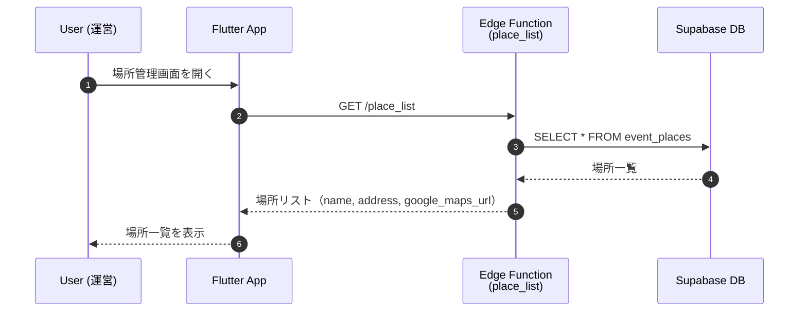
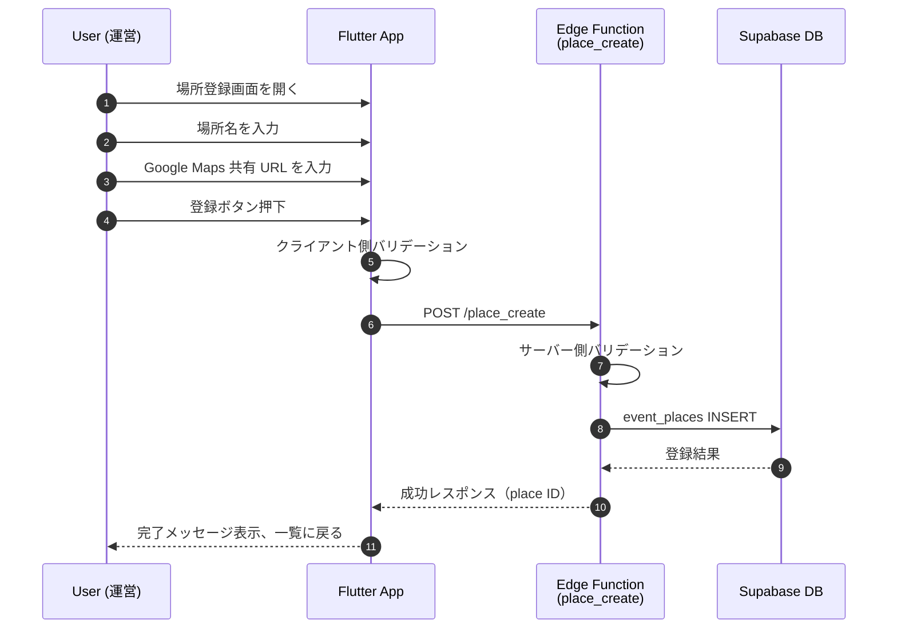
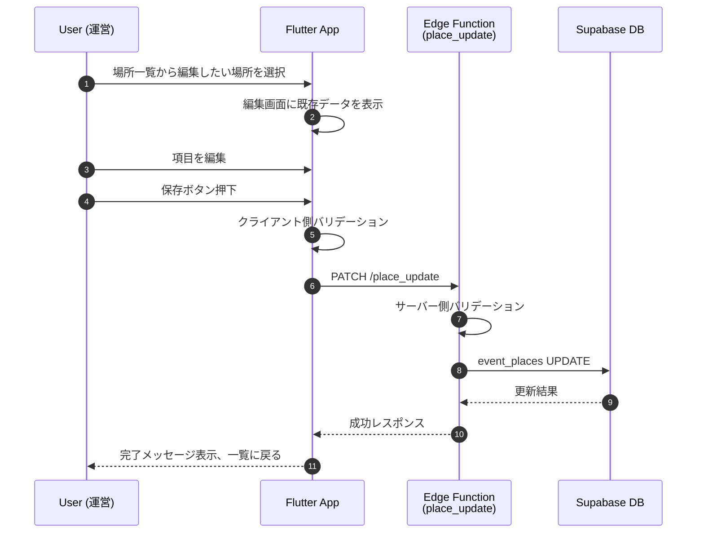
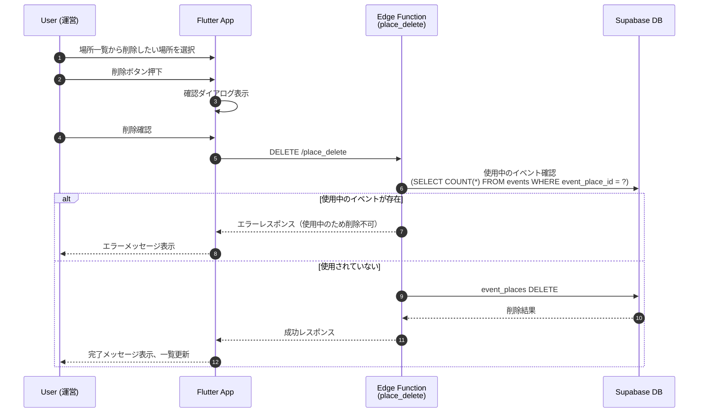

# 場所登録・管理 (Place Registration & Management)

## 概要

イベント作成時に使用する場所（会場）を事前に登録・管理する機能。運営メンバーが場所を登録し、イベント作成時は登録済みの場所から選択する方式を採用することで、場所情報の一貫性を保ち、入力の手間を削減する。

## ユーザーフロー / シーケンス

### 場所一覧・選択



### 場所新規登録



### 場所編集



### 場所削除



## データモデル / API

### 参照テーブル

- [`event_places`](tables.md#event_places) - 場所マスタ

### Edge Function: `place_list`

**エンドポイント**: `GET /place_list`

#### リクエスト

クエリパラメータなし

#### レスポンス

```json
{
  "places": [
    {
      "id": "uuid",
      "name": "○○体育館",
      "google_maps_url": "https://maps.app.goo.gl/xxxxx",
      "created_at": "2024-01-01T00:00:00Z"
    }
  ]
}
```

### Edge Function: `place_create`

**エンドポイント**: `POST /place_create`

#### リクエスト

| フィールド | 型 | 必須 | 説明 |
| --- | --- | --- | --- |
| `name` | `string` | ○ | 場所名（例: ○○体育館） |
| `google_maps_url` | `string` | ○ | Google Maps 共有 URL |

**リクエスト例**:
```json
{
  "name": "○○体育館",
  "google_maps_url": "https://maps.app.goo.gl/xxxxx"
}
```

#### レスポンス

```json
{
  "place_id": "uuid"
}
```

### Edge Function: `place_update`

**エンドポイント**: `PATCH /place_update`

#### リクエスト

| フィールド | 型 | 必須 | 説明 |
| --- | --- | --- | --- |
| `place_id` | `uuid` | ○ | 更新対象の場所 ID |
| `name` | `string` | ○ | 場所名 |
| `google_maps_url` | `string` | ○ | Google Maps 共有 URL |

**リクエスト例**:
```json
{
  "place_id": "uuid",
  "name": "○○体育館（変更後）",
  "google_maps_url": "https://maps.app.goo.gl/yyyyy"
}
```

#### レスポンス

```json
{
  "success": true
}
```

### Edge Function: `place_delete`

**エンドポイント**: `DELETE /place_delete`

#### リクエスト

| フィールド | 型 | 必須 | 説明 |
| --- | --- | --- | --- |
| `place_id` | `uuid` | ○ | 削除対象の場所 ID |

**リクエスト例**:
```json
{
  "place_id": "uuid"
}
```

#### レスポンス

**成功時**:
```json
{
  "success": true
}
```

**エラー時（使用中のイベントが存在）**:
```json
{
  "error": {
    "code": "PLACE_IN_USE",
    "message": "この場所は既存のイベントで使用されているため削除できません"
  }
}
```

## UI 要件

### 場所一覧画面

- 登録済みの場所をリスト表示
- 各場所に場所名を表示
- 各場所に対して「編集」「削除」アクションを提供
- 画面上部に「新規登録」ボタンを配置

### 場所登録・編集画面

#### 入力フィールド

1. **場所名** (必須)
   - テキスト入力
   - プレースホルダー: 例）○○体育館
   - 最大文字数: 120文字

2. **Google Maps 共有 URL** (必須)
   - テキスト入力（URL形式）
   - プレースホルダー: https://maps.app.goo.gl/xxxxx
   - ヘルプテキスト: 「Google Maps で場所を開き、共有→リンクをコピー で取得できます」

#### ボタン

- **登録** / **保存**: 入力内容を保存
- **キャンセル**: 入力を破棄して一覧に戻る

## バリデーション

### クライアント側

- **場所名**: 必須、1文字以上120文字以下
- **Google Maps URL**: 必須、URL形式（`https://` で始まる）

### サーバー側

- **場所名**: 必須、1文字以上120文字以下、既存の場所名と重複していないこと
- **Google Maps URL**: 必須、URL形式

## エラーハンドリング

### 場所登録・編集時

- **場所名が重複**: 「この場所名は既に登録されています」
- **URL形式が不正**: 「正しい URL 形式で入力してください」
- **ネットワークエラー**: 「通信エラーが発生しました。もう一度お試しください」

### 場所削除時

- **使用中のイベントが存在**: 「この場所は既存のイベントで使用されているため削除できません」
- **削除権限がない**: 「削除する権限がありません」

## 権限制御

- 場所の登録・編集・削除は運営メンバー全員が可能
- RLS は設定せず、認証済みユーザー全員がアクセス可能
- 将来的に権限を細分化する場合は、運営者ロールの導入を検討

## Google Maps 共有 URL について

### URL の取得方法

1. Google Maps で場所を検索
2. 「共有」ボタンをタップ
3. 「リンクをコピー」を選択
4. 取得した短縮 URL（`https://maps.app.goo.gl/xxxxx`）を入力

### URL の種類

Google Maps の共有 URL には以下の形式がある：

- **短縮 URL**: `https://maps.app.goo.gl/xxxxx` （推奨）
- **通常 URL**: `https://www.google.com/maps/place/...` （長い）
- **埋め込み URL**: `https://www.google.com/maps/embed?...` （iframe用）

本アプリでは、短縮 URL を推奨するが、いずれの形式も受け付ける。

## WebView での地図表示

場所情報を表示する際、WebView で `google_maps_url` を読み込むことで地図を表示する。

### Flutter 実装

```dart
import 'package:webview_flutter/webview_flutter.dart';

WebView(
  initialUrl: place.googleMapsUrl,
  javascriptMode: JavascriptMode.unrestricted,
)
```

### 注意事項

- WebView は Android/iOS でのみ動作（Web版では別途対応が必要）
- インターネット接続が必要

## 未決定事項 / Follow-up

- Google Maps URL のバリデーション強化（正規表現によるフォーマットチェック）
- 場所の表示順制御（50音順、登録日順など）
- 場所の検索・フィルタリング機能（場所が増えた場合）
- 使用中の場所を編集した場合の既存イベントへの影響範囲
