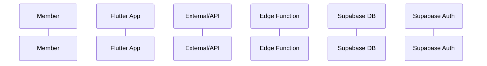

# <機能名> (<English Name>)

## ユーザーフロー / シーケンス

- 図のあとにステップ番号でテキスト説明を書く。
- 招待/認証など状態依存の分岐がある場合は、どの条件で枝分かれするかを番号付きで明記する。

## データモデル / API
- 参照・更新するテーブル（`<context>/tables.md` へのリンク推奨）。
- 関連 API / Edge Function 契約（Input/Process/Output/エラーコード）。
- 必要なら「トークン管理ポリシー」「リフレッシュ方針」のように小見出しで追加。

## 権限・セキュリティ
- RLS / ロール要件 / セキュリティ上の検証ポイント（署名検証など）。
- シークレットの扱い（Secret Manager など）を明記。

## エラー・フォールバック
- 主要エラーとユーザーへの導線（UI 未確定なら文言方針のみ）。

## 未決定事項 / Follow-up
- 追加で決めるべき項目を箇条書き。不要なら「なし」で可。
