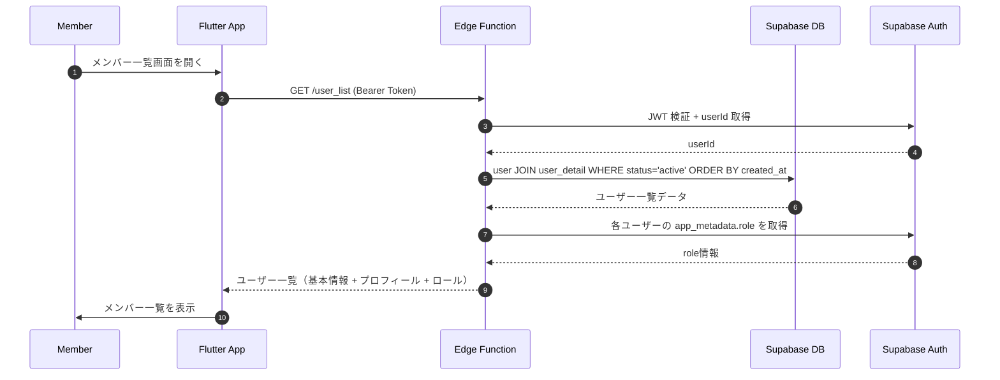

# ユーザ一覧取得 (User List)

## ユーザーフロー / シーケンス


1. **Member→App**: メンバー一覧画面を開く。
2. **App→Edge**: Supabase セッションの Bearer Token 付きで `GET /user_list` を呼び出し。
3. **Edge→Supabase**: `authMiddleware` で JWT を検証し、リクエストユーザーの `userId` を取得。
4. **Edge→DB**: `user` テーブルと `user_detail` テーブルを JOIN し、`status='active'` のユーザーを `created_at` 昇順で取得。
5. **Edge→Supabase**: 各ユーザーの `app_metadata.role` を取得。
6. **Edge→App**: 統合した情報を JSON 配列で返却。
7. **App→Member**: 取得したユーザー一覧を画面に表示。

## データモデル / API
- 参照テーブル: `user`、`user_detail`（[`auth/tables.md`](../auth/tables.md)）。
- Edge Function: `GET /user_list`
  - **Input**
    - Header: `Authorization: Bearer <access_token>`
  - **Process**
    1. `authMiddleware` で JWT を検証し、認証済みユーザーであることを確認。
    2. `user` テーブルと `user_detail` テーブルを `user.id = user_detail.user_id` で JOIN。
    3. `status = 'active'` でフィルタリング。
    4. `created_at` 昇順でソート。
    5. 各ユーザーの `app_metadata.role` を Supabase Auth から取得。
    6. 統合した情報を配列として返却。
  - **Output (成功)**
    ```json
    {
      "users": [
        {
          "userId": "uuid",
          "displayName": "表示名",
          "avatarUrl": "https://...",
          "status": "active",
          "lastLoginDatetime": "2025-01-01T00:00:00Z",
          "role": "member",
          "createdAt": "2024-12-01T00:00:00Z"
        },
        {
          "userId": "uuid",
          "displayName": "別のユーザー",
          "avatarUrl": null,
          "status": "active",
          "lastLoginDatetime": "2025-01-02T00:00:00Z",
          "role": "admin",
          "createdAt": "2024-12-02T00:00:00Z"
        }
      ]
    }
    ```
  - **エラーコード例**: `unauthorized`, `internal_error`。

## 権限・セキュリティ
- `authMiddleware` で JWT 検証を必須とし、未認証リクエストは 401 を返却。
- 全ての認証済みユーザーがアクセス可能（ロール制限なし）。
- 返却する情報は表示用の公開情報のみ（`line_user_id` など内部IDは含めない）。
- ロール情報は Supabase Auth の `app_metadata.role` から取得（DB に別途ロールテーブルは持たない）。

## エラー・フォールバック
- `unauthorized`: 「ログインが必要です。」を表示し、ログイン画面へ遷移。
- `internal_error`: 予期しないエラー。「データの取得に失敗しました。しばらくしてから再度お試しください。」を表示し、再試行を促す。

## 未決定事項 / Follow-up
- なし（現時点の方針で実装着手可）。
